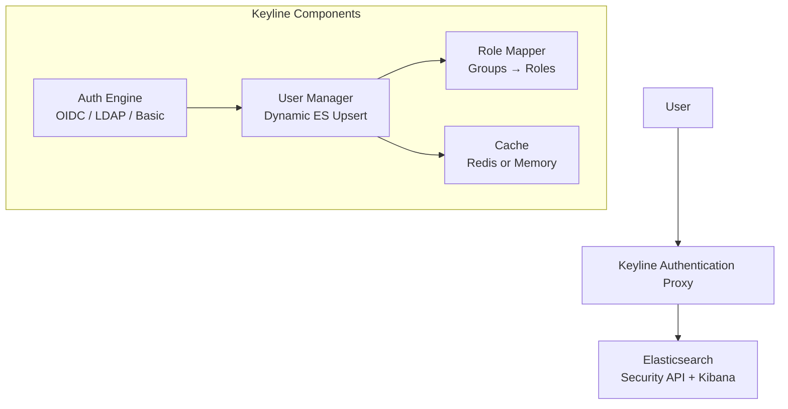
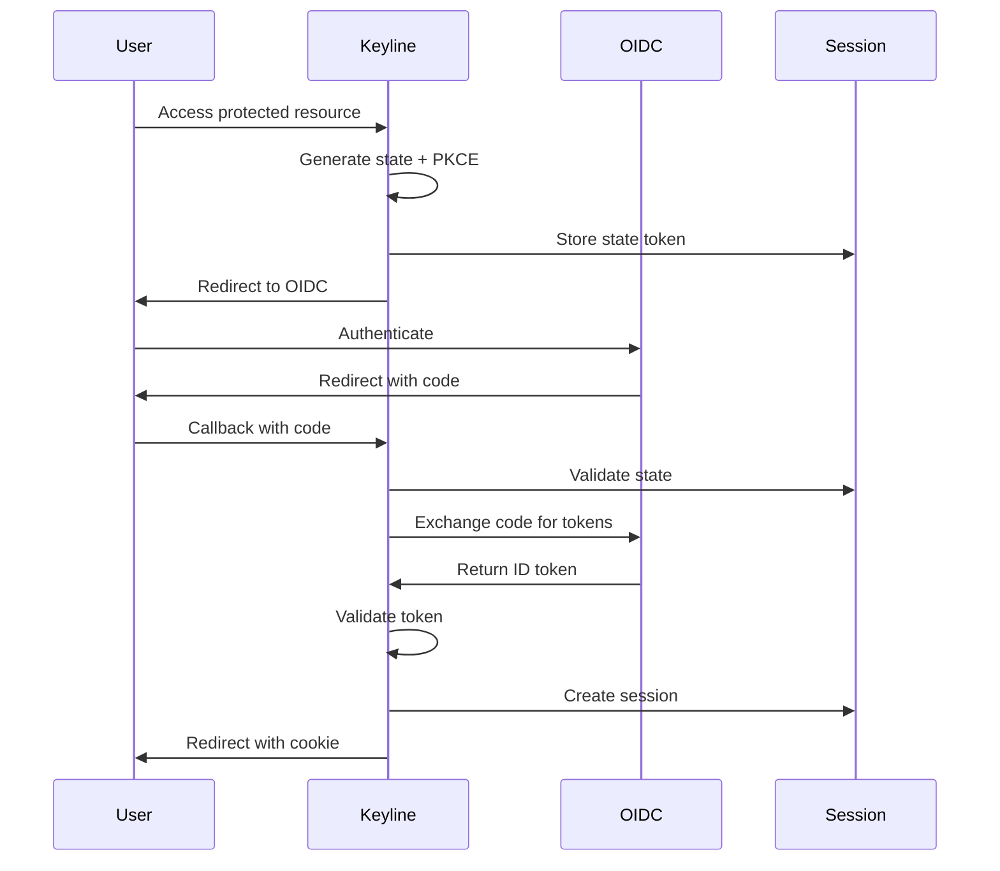

# Keyline Docusaurus Documentation - Design

## Overview

This design document describes the architecture and implementation approach for the Keyline documentation site using Docusaurus v3. The design follows the proven Secan project pattern while adapting to Keyline's specific content and deployment needs.

## Architecture

### High-Level Architecture

```
┌─────────────────────────────────────────────────────────────────┐
│                    Keyline Documentation Site                    │
├─────────────────────────────────────────────────────────────────┤
│  ┌───────────────────────────────────────────────────────────┐  │
│  │              Docusaurus v3 Core                            │  │
│  │  ┌──────────────┐  ┌──────────────┐  ┌──────────────┐    │  │
│  │  │    React     │  │   Markdown   │  │   MDX 2.0    │    │  │
│  │  │   Components │  │   Processor  │  │   Support    │    │  │
│  │  └──────────────┘  └──────────────┘  └──────────────┘    │  │
│  └───────────────────────────────────────────────────────────┘  │
│                                                                   │
│  ┌───────────────────────────────────────────────────────────┐  │
│  │              Content Layer                                 │  │
│  │  ┌──────────────┐  ┌──────────────┐  ┌──────────────┐    │  │
│  │  │   Docs/      │  │   Static/    │  │   Src/       │    │  │
│  │  │   (content)  │  │   (assets)   │  │   (custom)   │    │  │
│  │  └──────────────┘  └──────────────┘  └──────────────┘    │  │
│  └───────────────────────────────────────────────────────────┘  │
│                                                                   │
│  ┌───────────────────────────────────────────────────────────┐  │
│  │              Build & Deploy                                │  │
│  │  ┌──────────────┐  ┌──────────────┐  ┌──────────────┐    │  │
│  │  │   Webpack    │  │   GitHub     │  │   GitHub     │    │  │
│  │  │   Build      │  │  Actions     │  │   Pages      │    │  │
│  │  └──────────────┘  └──────────────┘  └──────────────┘    │  │
│  └───────────────────────────────────────────────────────────┘  │
└─────────────────────────────────────────────────────────────────┘
                              │
                              ▼
                    https://wasilak.github.io/keyline/
```

### Content Architecture

```
docs/
├── docusaurus.config.js          # Site configuration
├── sidebars.js                    # Navigation structure
├── package.json                   # Dependencies
├── README.md                      # Documentation README
│
├── docs/                          # Documentation content
│   ├── index.mdx                  # Landing page
│   ├── changelog.md               # Release changelog
│   │
│   ├── 01-getting-started/        # Section 1
│   │   ├── _category_.json        # Category metadata
│   │   ├── 01-about.md
│   │   ├── 02-architecture.md
│   │   ├── 03-quick-start.md
│   │   ├── 04-configuration-basics.md
│   │   └── 05-migration-from-elastauth.md
│   │
│   ├── 02-authentication/         # Section 2
│   │   ├── _category_.json
│   │   ├── 01-overview.md
│   │   ├── 02-oidc-authentication.md
│   │   ├── 03-local-users-basic-auth.md
│   │   ├── 04-session-management.md
│   │   └── 05-logout.md
│   │
│   ├── 03-user-management/        # Section 3
│   │   ├── _category_.json
│   │   ├── 01-dynamic-user-management.md
│   │   ├── 02-role-mappings.md
│   │   ├── 03-credential-caching.md
│   │   ├── 04-password-encryption.md
│   │   └── 05-admin-credentials.md
│   │
│   ├── 04-deployment-modes/       # Section 4
│   │   ├── _category_.json
│   │   ├── 01-forwardauth-traefik.md
│   │   ├── 02-auth-request-nginx.md
│   │   └── 03-standalone-proxy.md
│   │
│   ├── 05-deployment/             # Section 5
│   │   ├── _category_.json
│   │   ├── 01-docker.md
│   │   ├── 02-kubernetes.md
│   │   ├── 03-binary.md
│   │   ├── 04-high-availability.md
│   │   └── 05-security-best-practices.md
│   │
│   ├── 06-configuration/          # Section 6
│   │   ├── _category_.json
│   │   ├── 01-reference.md
│   │   ├── 02-environment-variables.md
│   │   ├── 03-examples.md
│   │   └── 04-validation.md
│   │
│   ├── 07-observability/          # Section 7
│   │   ├── _category_.json
│   │   ├── 01-logging.md
│   │   ├── 02-metrics.md
│   │   ├── 03-tracing.md
│   │   └── 04-health-checks.md
│   │
│   ├── 08-integrations/           # Section 8
│   │   ├── _category_.json
│   │   ├── 01-elasticsearch.md
│   │   ├── 02-kibana.md
│   │   ├── 03-oidc-providers.md
│   │   └── 04-redis.md
│   │
│   ├── 09-troubleshooting/        # Section 9
│   │   ├── _category_.json
│   │   ├── 01-general.md
│   │   ├── 02-oidc-issues.md
│   │   ├── 03-user-management.md
│   │   ├── 04-deployment.md
│   │   └── 05-faq.md
│   │
│   └── 10-contributing/           # Section 10
│       ├── _category_.json
│       ├── 01-development.md
│       ├── 02-testing.md
│       ├── 03-release-process.md
│       └── 04-security-reports.md
│
├── static/                        # Static assets
│   ├── img/
│   │   ├── logo.svg               # Site logo
│   │   ├── favicon.svg            # Favicon
│   │   ├── secan-social-card.jpg  # Social sharing card
│   │   ├── diagrams/              # Architecture diagrams
│   │   │   ├── architecture-overview.png
│   │   │   ├── oidc-flow.png
│   │   │   ├── user-upsert-flow.png
│   │   │   ├── forwardauth-mode.png
│   │   │   └── standalone-mode.png
│   │   └── screenshots/           # UI screenshots
│   │       └── health-check-response.png
│   └── api/                       # Future API docs
│
└── src/
    ├── css/
    │   └── custom.css             # Custom styling
    └── components/                # Custom React components
        └── (future components)
```

## Component Design

### 1. Site Configuration (`docusaurus.config.js`)

**Purpose**: Configure Docusaurus site metadata, theme, and plugins

**Key Configuration**:
```javascript
{
  title: 'Keyline',
  tagline: 'Modern Authentication Proxy for Elasticsearch',
  favicon: 'img/favicon.svg',
  
  url: 'https://wasilak.github.io',
  baseUrl: '/keyline/',
  
  organizationName: 'wasilak',
  projectName: 'keyline',
  
  onBrokenLinks: 'warn',
  onBrokenMarkdownLinks: 'warn',
  
  i18n: {
    defaultLocale: 'en',
    locales: ['en'],
  },
  
  presets: [
    ['classic', {
      docs: {
        sidebarPath: './sidebars.js',
        editUrl: 'https://github.com/wasilak/keyline/tree/main/docs/',
        lastVersion: 'current',
        versions: {
          current: { label: '1.0.x (Latest)' },
        },
      },
      blog: false,
      theme: {
        customCss: './src/css/custom.css',
      },
    }],
  ],
  
  themeConfig: {
    // Navbar, footer, color mode, prism, mermaid config
  },
  
  themes: ['@docusaurus/theme-mermaid'],
}
```

### 2. Sidebar Configuration (`sidebars.js`)

**Purpose**: Define navigation structure for documentation

**Structure**:
```javascript
module.exports = {
  docs: [
    {
      type: 'category',
      label: 'Getting Started',
      collapsed: false,
      items: [
        '01-getting-started/01-about',
        '01-getting-started/02-architecture',
        '01-getting-started/03-quick-start',
        '01-getting-started/04-configuration-basics',
        '01-getting-started/05-migration-from-elastauth',
      ],
    },
    // ... 9 more categories
  ],
};
```

### 3. Category Metadata (`_category_.json`)

**Purpose**: Configure category behavior in sidebar

**Example**:
```json
{
  "label": "Getting Started",
  "position": 1,
  "link": {
    "type": "generated-index",
    "description": "Learn how to get started with Keyline"
  }
}
```

### 4. GitHub Actions Workflow (`.github/workflows/docs.yml`)

**Purpose**: Automated build and deployment to GitHub Pages

**Two-Job Pipeline**:

**Job 1: Build**
```yaml
build:
  runs-on: ubuntu-latest
  steps:
    - uses: actions/checkout@v6
    - uses: actions/setup-node@v6
      with:
        node-version: '24'
        cache: 'npm'
        cache-dependency-path: docs/package-lock.json
    - uses: go-task/setup-task@v1
    - run: task docs:install
    - run: task docs:build
    - uses: actions/upload-artifact@v7
      with:
        name: docs-site
        path: docs/build/
```

**Job 2: Deploy**
```yaml
deploy:
  needs: [build]
  if: github.ref == 'refs/heads/main'
  runs-on: ubuntu-latest
  permissions:
    pages: write
    id-token: write
  environment:
    name: github-pages
  steps:
    - uses: actions/download-artifact@v8
    - uses: actions/configure-pages@v5
    - uses: actions/upload-pages-artifact@v4
    - uses: actions/deploy-pages@v4
```

### 5. Taskfile Integration (`Taskfile.yml`)

**Purpose**: Standardize documentation development workflow

**Tasks**:
```yaml
docs:install:
  desc: Install Docusaurus dependencies
  dir: docs
  cmds:
    - npm ci

docs:dev:
  desc: Start development server
  dir: docs
  cmds:
    - npm run start

docs:build:
  desc: Build for production
  dir: docs
  env:
    NODE_OPTIONS: "--no-deprecation"
  cmds:
    - npm run build

docs:preview:
  desc: Preview production build
  dir: docs
  cmds:
    - npm run serve
```

## Content Migration Strategy

### Source Files Analysis

| Source | Files | Content Type | Migration Approach |
|--------|-------|--------------|-------------------|
| `docs/*.md` | 16 | User guides, troubleshooting | Direct migration with reformatting |
| `README.md` | 1 | Project overview | Split: overview → about, quick start → quick-start |
| `RELEASE-NOTES.md` | 1 | Changelog | Migrate to changelog.md |
| `config/*.yaml` | 8 | Configuration examples | Extract to configuration examples |
| `docker-compose*.yml` | 5 | Deployment examples | Extract to deployment guides |
| `.spec-workflow/specs/` | 4 | Dynamic user mgmt spec | Extract technical details |
| `.kiro/specs/` | 6 | Auth proxy spec (archived) | Extract architecture details |
| `.kiro/steering/` | 6 | Steering docs | Keep archived, reference if needed |

### Migration Mapping

| New Location | Source Content | Transformations |
|--------------|----------------|-----------------|
| `01-getting-started/01-about.md` | README.md (first sections) | Extract overview, features, use cases |
| `01-getting-started/02-architecture.md` | README.md + .kiro specs | Create Mermaid diagrams |
| `01-getting-started/03-quick-start.md` | TESTING-QUICK.md + README | Combine quick start guides |
| `01-getting-started/05-migration-from-elastauth.md` | ELASTAUTH-TO-KEYLINE-EVOLUTION.md | Minor edits, add checklist |
| `02-authentication/*.md` | README.md + .kiro specs | Extract auth flow details |
| `03-user-management/*.md` | user-management.md + specs | Expand with examples |
| `04-deployment-modes/*.md` | deployment.md + FORWARDAUTH-TESTING.md | Split by mode |
| `05-deployment/*.md` | deployment.md + docker-compose-README.md | Organize by platform |
| `06-configuration/*.md` | configuration.md + config examples | Create reference + examples |
| `07-observability/*.md` | README.md + config examples | Extract monitoring details |
| `09-troubleshooting/*.md` | troubleshooting*.md | Consolidate and organize |
| `10-contributing/*.md` | TESTING*.md + RELEASE-TAGGING.md | Create contributor guide |

## Visual Design

### Theme Configuration

**Color Scheme** (Catppuccin-inspired):
```javascript
colorMode: {
  defaultMode: 'dark',
  disableSwitch: false,
  respectPrefersColorScheme: true,
}

prism: {
  theme: require('prism-react-renderer').themes.github,
  darkTheme: require('prism-react-renderer').themes.dracula,
}

mermaid: {
  theme: {
    light: 'default',
    dark: 'dark',
  },
}
```

### Diagrams (Mermaid)

**Architecture Overview**:


**OIDC Flow**:


## Data Flow

### Build Process

```
1. Developer writes markdown in docs/docs/
   ↓
2. Docusaurus processes markdown + MDX
   ↓
3. Webpack bundles React application
   ↓
4. Static HTML/CSS/JS generated in docs/build/
   ↓
5. GitHub Actions uploads to GitHub Pages
   ↓
6. Site served at wasilak.github.io/keyline/
```

### Development Workflow

```
1. Developer runs: task docs:dev
   ↓
2. Docusaurus dev server starts at localhost:3000/keyline/
   ↓
3. Hot reload on file changes
   ↓
4. Developer previews changes
   ↓
5. Commit and push to main
   ↓
6. GitHub Actions auto-deploys
```

## Error Handling Strategy

### Build Errors

| Error | Handling |
|-------|----------|
| Broken links | `onBrokenLinks: 'warn'` - log warning, continue build |
| Missing images | Build fails with descriptive error |
| Invalid markdown | Build fails with line number |
| Mermaid syntax error | Diagram shows error message |
| Config validation error | Build fails with specific error |

### Runtime Errors

| Error | Handling |
|-------|----------|
| 404 page | Custom 404 page with search |
| Search index failure | Graceful degradation, search disabled |
| Theme switch error | Fallback to system preference |

## Performance Considerations

### Build Optimization

- **Code splitting**: Automatic per-page bundles
- **Lazy loading**: Images and components loaded on demand
- **Tree shaking**: Unused code eliminated
- **Minification**: CSS and JS minified in production

### Runtime Optimization

- **Static HTML**: Pre-rendered pages for instant load
- **Client-side hydration**: React takes over after initial load
- **Prefetching**: Next pages prefetched on hover
- **Cache strategy**: Aggressive caching with version invalidation

### Performance Targets

| Metric | Target |
|--------|--------|
| Build time | < 2 minutes |
| First contentful paint | < 1 second |
| Time to interactive | < 2 seconds |
| Lighthouse score | > 90 |

## Security Considerations

### Content Security

- **No user-generated content**: All content is reviewed before deployment
- **No external scripts**: All dependencies bundled
- **HTTPS enforced**: GitHub Pages provides HTTPS by default
- **No cookies**: Static site has no session management

### Dependency Security

- **Lock files**: `package-lock.json` ensures reproducible builds
- **Automated updates**: Dependabot for security patches
- **Minimal dependencies**: Only essential packages included

## Testing Strategy

### Build Verification

1. **Local build test**: `task docs:build` succeeds
2. **Link check**: No broken internal links
3. **Image check**: All images load correctly
4. **Mobile test**: Responsive design verified

### CI/CD Verification

1. **GitHub Actions build**: Pipeline succeeds
2. **Artifact upload**: Build artifact created
3. **Deployment**: Pages deployment succeeds
4. **Smoke test**: Live site accessible

## Monitoring and Observability

### GitHub Pages Metrics

- **Traffic**: GitHub Pages provides basic analytics
- **Referrers**: Track where users come from
- **Popular pages**: Identify most-used documentation

### Error Monitoring

- **Build failures**: GitHub Actions notifications
- **Broken links**: Build warnings logged
- **User reports**: GitHub Issues for content problems

## Out of Scope

- API reference documentation (future phase)
- Video tutorials
- Interactive playgrounds
- Multi-language support
- Blog or news section
- User forums or comments
