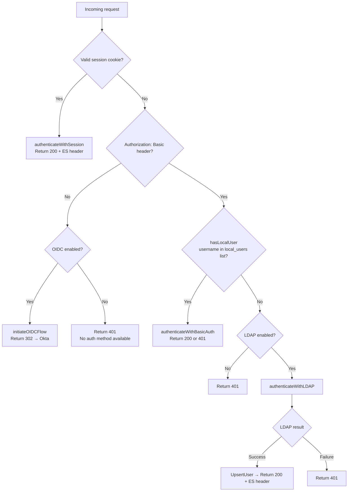
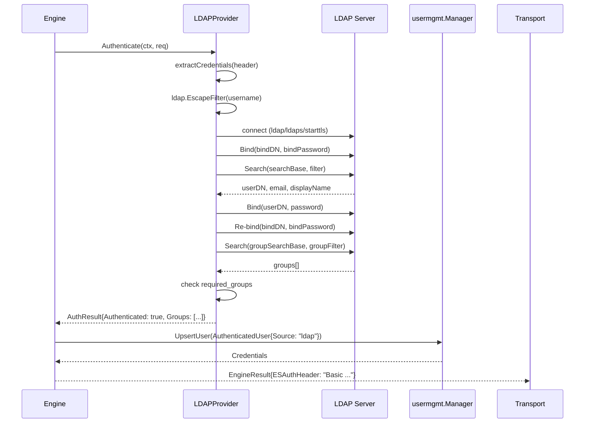

# Design Document

## Overview

This document describes the technical design for adding LDAP as a third authentication provider to Keyline. The implementation plugs into the existing auth engine at the provider level — no changes are required in the transport layer (`standalone.go`, `forward_auth.go`) or the user management pipeline (`usermgmt/`).

The design follows the established `BasicAuthProvider` pattern exactly: a new `LDAPProvider` struct implements the same `Authenticate(ctx, *AuthRequest) *AuthResult` interface. The engine is updated to route Basic Auth requests to either local users or LDAP based on username lookup, with OIDC remaining the no-credentials fallback.

---

## Steering Document Alignment

### Technical Standards (tech.md)
- **Language**: Go — consistent with all existing Keyline code
- **No new frameworks**: Uses `github.com/go-ldap/ldap/v3` (standard Go LDAP library), `golang.org/x/crypto` already present for bcrypt, standard `crypto/tls` for TLS handling
- **Testing**: `go test` with `testify` assertions, matching existing `basic_test.go` patterns; 80% coverage target
- **Linting**: All new code passes `golangci-lint` under `.golangci.yaml`

### Project Structure (structure.md)
- New provider file: `internal/auth/ldap.go` — follows existing `internal/auth/basic.go` location and naming
- New test file: `internal/auth/ldap_test.go` — mirrors `internal/auth/basic_test.go`
- Config additions: `internal/config/config.go` and `internal/config/validator.go` — same files as all other config changes
- No new packages or directories required

---

## Code Reuse Analysis

### Existing Components to Leverage

- **`AuthRequest` / `AuthResult`** (`internal/auth/basic.go`): LDAP provider uses the exact same request/result types — no new types needed.
- **`extractCredentials`** (`internal/auth/basic.go`): Currently a method on `BasicAuthProvider`. Will be refactored to a package-level function so both `BasicAuthProvider` and `LDAPProvider` can call it without duplication.
- **`usermgmt.AuthenticatedUser`** (`internal/usermgmt/manager.go`): Already has all fields LDAP needs — `Username`, `Groups`, `Email`, `FullName`, `Source`. No changes required.
- **`usermgmt.Manager.UpsertUser`**: LDAP auth calls `UpsertUser` identically to basic auth — same pipeline, same role mapping, same credential caching.
- **`Engine.authenticateWithBasicAuth`**: Unchanged. A new `hasLocalUser` helper gates whether basic auth is attempted, so the existing method is never modified.
- **`config.Config` struct pattern**: `LDAPConfig` follows the same `mapstructure` tag convention as `OIDCConfig` and `LocalUsersConfig`.
- **Validator pattern**: `validateLDAP` follows the same error-accumulation pattern as the existing inline OIDC and local_users validation blocks in `validator.go`.

### Integration Points

- **Auth Engine** (`internal/auth/engine.go`): Central wiring point. Receives `ldapProvider` and `ldapEnabled`; routes Basic Auth requests via `hasLocalUser` check.
- **Config loader** (`internal/config/loader.go`): No changes needed — Viper/mapstructure picks up the new `LDAP` field automatically.
- **Startup** (`cmd/keyline/main.go`): One-line addition to the existing `"Configuration loaded"` log.

---

## Architecture

### Auth Flow with All Three Providers



### LDAP Authentication Internal Flow



### Modular Design Principles
- **`ldap.go`** owns only LDAP protocol interaction (connect, search, bind). No engine logic.
- **`engine.go`** owns routing and fallthrough logic. No LDAP protocol knowledge.
- **`config.go` / `validator.go`** own config shape and validation. No provider logic.
- **`basic.go`** retains all existing logic; only `extractCredentials` is promoted to package-level.

---

## Components and Interfaces

### `LDAPProvider` (`internal/auth/ldap.go`)

- **Purpose:** Authenticate a user against an LDAP server using credentials from a Basic Auth header. Returns user identity, email, display name, and group memberships.
- **Interfaces:**
  ```go
  func NewLDAPProvider(cfg *config.LDAPConfig) (*LDAPProvider, error)
  func (p *LDAPProvider) Authenticate(ctx context.Context, req *AuthRequest) *AuthResult
  ```
- **Internal methods:** `connect`, `searchUser`, `searchGroups`
- **Package-level helpers:** `hasAnyGroup`
- **Dependencies:** `github.com/go-ldap/ldap/v3`, `crypto/tls`, `internal/config`
- **Reuses:** `extractCredentials` (package-level, from `basic.go`), `AuthRequest`, `AuthResult`

### `extractCredentials` (package-level, `internal/auth/basic.go`)

- **Purpose:** Parse `Authorization: Basic <base64>` header into `(username, password, error)`. Shared by `BasicAuthProvider` and `LDAPProvider`.
- **Signature:** `func extractCredentials(header string) (string, string, error)`
- **Change:** Promoted from `(p *BasicAuthProvider) extractCredentials` method to a standalone function. Existing call site in `BasicAuthProvider.Authenticate` updated to call `extractCredentials(header)` directly.

### `Engine` updates (`internal/auth/engine.go`)

- **New fields:** `ldapProvider *LDAPProvider`, `ldapEnabled bool`
- **New helper:** `hasLocalUser(username string) bool` — scans `e.config.LocalUsers.Users` for matching username
- **Updated `Authenticate`:** Routes Basic Auth via `hasLocalUser` check before deciding between `authenticateWithBasicAuth` and `authenticateWithLDAP`
- **New method:** `authenticateWithLDAP(ctx, *EngineRequest) *EngineResult` — mirrors `authenticateWithBasicAuth` structure exactly

### `LDAPConfig` (`internal/config/config.go`)

- **Purpose:** Holds all LDAP configuration. Added as `LDAP LDAPConfig` field on `Config`.

```go
type LDAPConfig struct {
    Enabled              bool          `mapstructure:"enabled"`
    URL                  string        `mapstructure:"url"`
    BindDN               string        `mapstructure:"bind_dn"`
    BindPassword         string        `mapstructure:"bind_password"`
    ConnectionTimeout    time.Duration `mapstructure:"connection_timeout"`
    TLSMode              string        `mapstructure:"tls_mode"`
    TLSSkipVerify        bool          `mapstructure:"tls_skip_verify"`
    SearchBase           string        `mapstructure:"search_base"`
    SearchFilter         string        `mapstructure:"search_filter"`
    GroupSearchBase      string        `mapstructure:"group_search_base"`
    GroupSearchFilter    string        `mapstructure:"group_search_filter"`
    UsernameAttribute    string        `mapstructure:"username_attribute"`
    EmailAttribute       string        `mapstructure:"email_attribute"`
    DisplayNameAttribute string        `mapstructure:"display_name_attribute"`
    GroupNameAttribute   string        `mapstructure:"group_name_attribute"`
    RequiredGroups       []string      `mapstructure:"required_groups"`
}
```

### `validateLDAP` (`internal/config/validator.go`)

- **Purpose:** Validate LDAP config block when `ldap.enabled: true`. Integrated into the existing `Validate` function's error-accumulation pattern.
- **Validates:** URL presence and scheme (`ldap://`/`ldaps://`), BindDN, BindPassword, SearchBase, SearchFilter (must contain `{username}`), TLSMode enum (`none`/`ldaps`/`starttls`/`""`)
- **Auth method check update:** `cfg.OIDC.Enabled || cfg.LocalUsers.Enabled` → `cfg.OIDC.Enabled || cfg.LocalUsers.Enabled || cfg.LDAP.Enabled`

---

## Data Models

### `LDAPConfig`
```
LDAPConfig
- Enabled              bool
- URL                  string          // ldap:// or ldaps://
- BindDN               string          // Service account DN
- BindPassword         string          // From env var
- ConnectionTimeout    time.Duration   // Default: 10s
- TLSMode              string          // "none" | "ldaps" | "starttls"
- TLSSkipVerify        bool            // Startup warning if true
- SearchBase           string          // e.g. "DC=example,DC=com"
- SearchFilter         string          // Must contain {username}
- GroupSearchBase      string          // Optional
- GroupSearchFilter    string          // Optional, supports {user_dn}
- UsernameAttribute    string          // Default: sAMAccountName
- EmailAttribute       string          // Default: mail
- DisplayNameAttribute string          // Default: displayName
- GroupNameAttribute   string          // Default: cn
- RequiredGroups       []string        // Optional access control
```

### `AuthResult` (unchanged, from `basic.go`)
```
AuthResult
- Authenticated bool
- Username      string
- Email         string
- FullName      string
- Groups        []string   // Populated from LDAP group search
- Source        string     // "ldap" for LDAP-authenticated users
- Error         error
```

---

## Error Handling

### Error Scenarios

1. **LDAP server unreachable (connection refused / timeout)**
   - **Handling:** `connect()` returns error → `Authenticate` returns `AuthResult{Authenticated: false, Error: "LDAP connection failed"}` → engine returns 500
   - **User Impact:** 500 response; no credentials leak

2. **Service account bind fails (wrong bind_dn or bind_password)**
   - **Handling:** `Bind(bindDN, bindPassword)` error → `AuthResult{Authenticated: false, Error: "LDAP service unavailable"}` → engine returns 500
   - **User Impact:** 500 response; misconfiguration must be fixed by operator

3. **User not found in LDAP (search returns 0 entries)**
   - **Handling:** `searchUser` returns error → `AuthResult{Authenticated: false, Error: "user not found"}` → engine returns 401
   - **User Impact:** 401 response

4. **Wrong password (user bind fails)**
   - **Handling:** `Bind(userDN, password)` error → `AuthResult{Authenticated: false, Error: "invalid credentials"}` → engine returns 401
   - **User Impact:** 401 response

5. **Group search fails**
   - **Handling:** Non-fatal — log warning, continue with `groups = []string{}`; authentication succeeds with empty groups
   - **User Impact:** Auth succeeds; user may get default ES roles only (no group-based roles)

6. **Required groups not met**
   - **Handling:** `hasAnyGroup` returns false → `AuthResult{Authenticated: false, Error: "user not in required groups"}` → engine returns 401
   - **User Impact:** 401 response with no further detail exposed

7. **Invalid Basic Auth header (bad base64, missing colon)**
   - **Handling:** `extractCredentials` returns error → `AuthResult{Authenticated: false}` → engine returns 401
   - **User Impact:** 401 response

---

## Testing Strategy

### Unit Testing (`internal/auth/ldap_test.go`)

Framework: `testify` (`require` + `assert`), package `auth`, naming convention `TestLDAPProvider_MethodName_Scenario`.

Mocking strategy: wrap `*ldap.Conn` operations behind a `ldapConn` interface with `Bind`, `Search`, `Close`, `SetTimeout` methods. `LDAPProvider` accepts this interface internally for testability; production code passes `*ldap.Conn` directly.

Test cases:
- `TestNewLDAPProvider_NotEnabled` — constructor rejects disabled config
- `TestNewLDAPProvider_MissingURL` — constructor rejects empty URL
- `TestNewLDAPProvider_Defaults` — verify default attribute names are set
- `TestLDAPProvider_Authenticate_Success` — full happy path with groups
- `TestLDAPProvider_Authenticate_WrongPassword` — user bind fails → 401
- `TestLDAPProvider_Authenticate_UserNotFound` — search returns 0 entries → 401
- `TestLDAPProvider_Authenticate_ServiceAccountBindFail` — first bind fails → 500
- `TestLDAPProvider_Authenticate_GroupSearchFail_ContinuesWithEmptyGroups` — non-fatal group error
- `TestLDAPProvider_Authenticate_RequiredGroupsNotMet` — auth ok, groups mismatch → 401
- `TestLDAPProvider_Authenticate_RequiredGroupsMet` — auth ok, group matches
- `TestLDAPProvider_InjectionPrevention` — username with LDAP special chars is escaped

### Unit Testing (`internal/config/validator_test.go`)

Framework: standard `testing` package (matches existing validator tests). Pattern: `strings.Contains(err.Error(), "expected substring")`.

Test cases:
- `TestValidate_LDAPEnabled_Success`
- `TestValidate_LDAPMissingURL`
- `TestValidate_LDAPInvalidURLScheme`
- `TestValidate_LDAPMissingBindDN`
- `TestValidate_LDAPMissingBindPassword`
- `TestValidate_LDAPMissingSearchBase`
- `TestValidate_LDAPMissingSearchFilter`
- `TestValidate_LDAPSearchFilterMissingPlaceholder`
- `TestValidate_LDAPInvalidTLSMode`
- `TestValidate_LDAPDisabled_NoValidation`

### Integration Testing

Existing integration test suite in `integration/` uses Docker Compose. LDAP integration tests are **out of scope for this spec** — adding an OpenLDAP test container is a separate effort. The unit tests with mocked LDAP connections provide sufficient coverage for v1.
