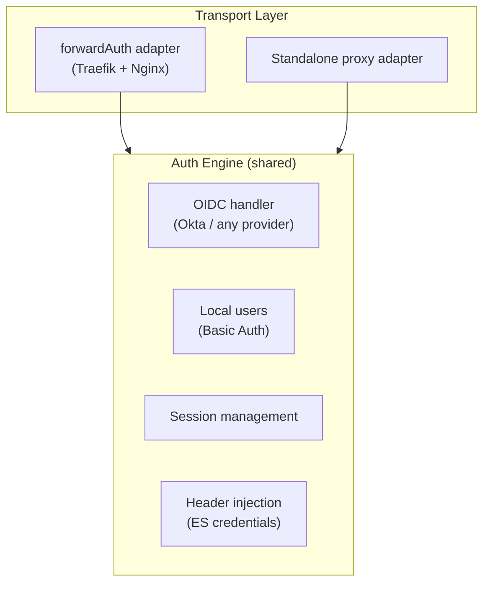
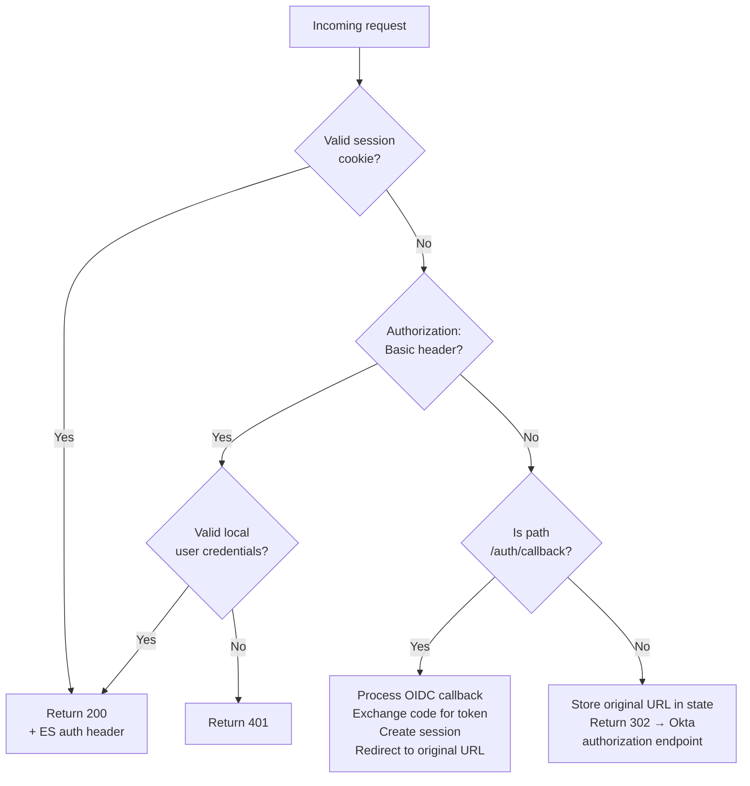
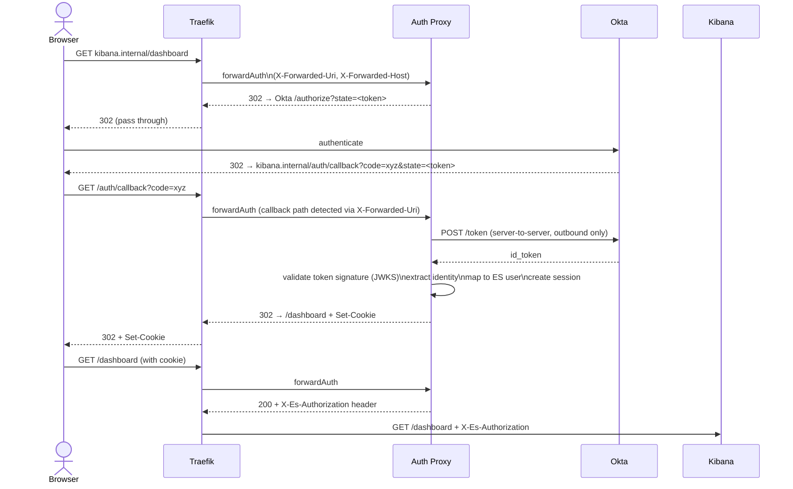
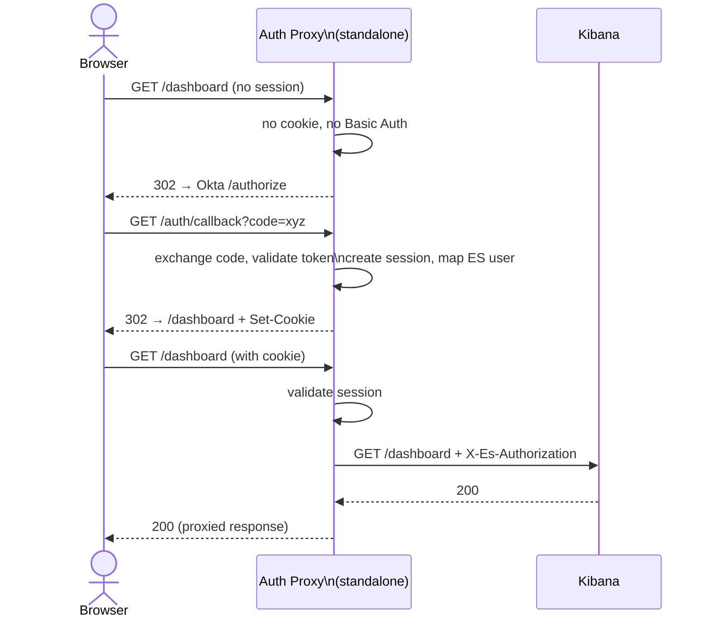
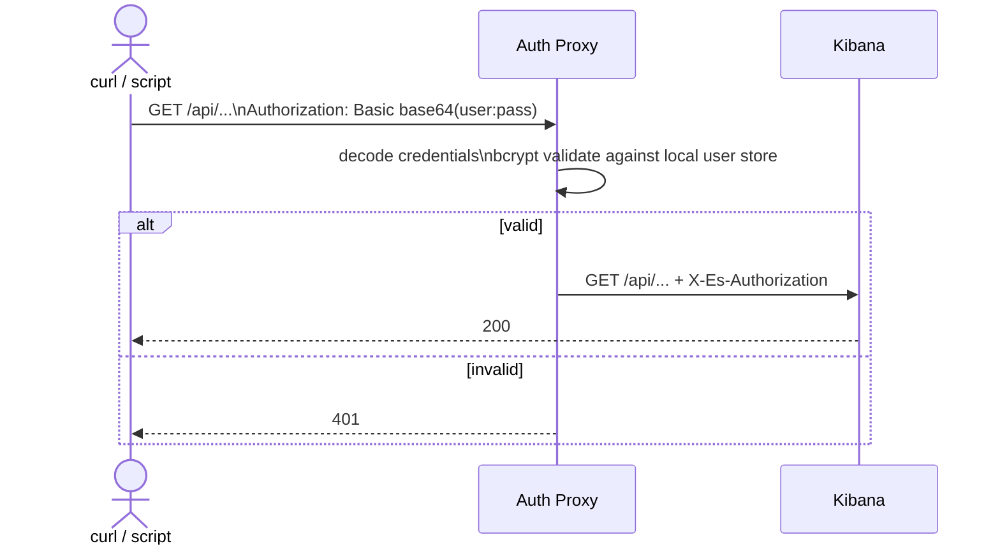

# Auth Proxy — Implementation Spec

> Successor to `elastauth` + `authelia`. Generic authentication proxy with Elasticsearch credential injection. Supports OIDC (Okta) for browser users and local users for programmatic access — both simultaneously. Name TBD.

---

## Context & Motivation

Current stack for Kibana auth:

```
User → Traefik → [Authelia forwardAuth + elastauth forwardAuth] → Kibana
```

- **Authelia** — handles authentication against LDAP (Active Directory)
- **elastauth** — generates Elasticsearch auth headers for the authenticated user

Problems:
- Two chained forwardAuth services, tightly coupled
- LDAP dependency — want to migrate to Okta
- Authelia supports either LDAP or OIDC, not both simultaneously
- Programmatic (curl) access would break with a pure OIDC migration
- Not reusable outside of Traefik

This spec describes a single service that replaces both, supports multiple auth modes simultaneously, and works with Traefik, Nginx, or standalone.

---

## Core Design

### Three layers



The auth logic — OIDC flow, Basic Auth validation, session storage, credential mapping — lives once in the core. The transport adapter is a thin wrapper.

### Auth mode selection (per request)



Both modes are always active. Selection is automatic based on what the client sends — no configuration switch needed.

---

## OIDC Auto-Discovery

On startup, the app fetches the OIDC discovery document:

```
GET {issuer_url}/.well-known/openid-configuration
```

For example:
```
GET https://company.okta.com/.well-known/openid-configuration
```

From this document the app derives all endpoints automatically — no manual URL configuration needed:

| Field in discovery doc | Used for |
|---|---|
| `authorization_endpoint` | Redirecting browser to Okta login |
| `token_endpoint` | Exchanging auth code for tokens (server-to-server) |
| `userinfo_endpoint` | Fetching user claims after token exchange |
| `jwks_uri` | Fetching public keys for ID token signature validation |
| `issuer` | Validated against configured `issuer_url` — mismatch = startup failure |

The discovery document is fetched once at startup and cached. The app should also support periodic refresh (e.g. every 24h) to pick up key rotations via `jwks_uri`.

> ⚠️ Okta uses a custom authorization server by default. The correct issuer URL may be `https://company.okta.com/oauth2/default` (not just `https://company.okta.com`). Verify with the Okta admin — the discovery endpoint must return a valid document or the app will refuse to start.

---

## Deployment Modes

### Mode 1 — Traefik forwardAuth



Traefik config:

```yaml
middlewares:
  appname-auth:
    forwardAuth:
      address: "http://appname:8080/auth"
      trustForwardHeader: true
      authResponseHeaders:
        - "X-Es-Authorization"
```

### Mode 2 — Nginx auth_request

Functionally identical to Traefik. The only difference is header name normalisation on ingress:

| Traefik header | Nginx equivalent |
|---|---|
| `X-Forwarded-Uri` | `X-Original-URI` |
| `X-Forwarded-Method` | `X-Original-Method` |
| `X-Forwarded-Host` | `X-Original-Host` (or `Host`) |

The app normalises both conventions into an internal `RequestContext` struct. No other Nginx-specific code.

Nginx config:

```nginx
location / {
    auth_request /auth;
    auth_request_set $es_auth $upstream_http_x_es_authorization;
    proxy_set_header X-Es-Authorization $es_auth;
    proxy_pass http://kibana:5601;
}

location = /auth {
    internal;
    proxy_pass http://appname:8080/auth;
    proxy_set_header X-Original-URI $request_uri;
    proxy_set_header X-Original-Method $request_method;
    proxy_set_header X-Original-Host $host;
    proxy_set_header X-Forwarded-For $proxy_add_x_forwarded_for;
    proxy_pass_request_body off;
    proxy_set_header Content-Length "";
}

# Callback must bypass auth_request — it IS the auth response
location /auth/callback {
    proxy_pass http://appname:8080/auth;
    proxy_set_header X-Original-URI $request_uri;
    proxy_set_header X-Original-Host $host;
}
```

### Mode 3 — Standalone proxy

Auth Proxy sits directly in front of the upstream. No Traefik or Nginx required.



In standalone mode:
- `httputil.ReverseProxy` handles proxying (streaming, WebSocket upgrades, hop-by-hop headers)
- `/auth/callback`, `/auth/logout`, `/healthz` are handled internally and never forwarded upstream
- The OIDC `redirect_url` is the Auth Proxy's own host (not the upstream's host)

### Mode comparison

|                           | forwardAuth (Traefik/Nginx)    | Standalone proxy                 |
| ------------------------- | ------------------------------ | -------------------------------- |
| Who proxies requests      | Traefik / Nginx                | Auth Proxy itself                |
| Callback URL host         | Protected service host         | Auth Proxy's own host            |
| `/auth/callback` handling | Detected via `X-Forwarded-Uri` | Matched directly on path         |
| WebSocket support         | Handled by reverse proxy       | App must forward upgrade headers |
| Upstream health checks    | Not app's concern              | App handles timeouts + errors    |

> ⚠️ `redirect_url` in OIDC config **must be set explicitly** — it differs between modes and cannot be auto-derived.

---

## Programmatic Access Flow (all modes)



No session, no cookie, no redirect. Stateless per-request validation.

---

## Endpoints

| Path | Method | Forwarded to upstream? | Notes |
|---|---|---|---|
| `/auth` | `GET` | No | forwardAuth entrypoint |
| `/auth/callback` | `GET` | No | OIDC callback, always handled internally |
| `/auth/logout` | `GET` | No | Invalidates session, redirects to Okta logout |
| `/healthz` | `GET` | No | Health check, no auth |
| `/*` | `*` | Yes (standalone only) | All other paths proxied to upstream |

---

## Configuration

```yaml
server:
  port: 8080
  mode: "forward_auth"   # or "standalone"
  session_secret: "${SESSION_SECRET}"
  session_ttl: "24h"
  cookie_name: "appname_session"
  cookie_secure: true

oidc:
  enabled: true
  issuer_url: "https://company.okta.com/oauth2/default"
  # App auto-discovers all endpoints from {issuer_url}/.well-known/openid-configuration
  # No manual auth_url / token_url / jwks_uri needed
  client_id: "${OIDC_CLIENT_ID}"
  client_secret: "${OIDC_CLIENT_SECRET}"
  redirect_url: "https://kibana.internal/auth/callback"  # must match Okta app config; differs by mode
  scopes: ["openid", "profile", "email"]

local_users:
  enabled: true
  users:
    - username: "ci-pipeline"
      password_bcrypt: "${CI_PIPELINE_PASSWORD_HASH}"
      es_user: "kibana_ci"
    - username: "monitoring"
      password_bcrypt: "${MONITORING_PASSWORD_HASH}"
      es_user: "kibana_monitoring"

# Standalone mode only
upstream:
  url: "http://kibana:5601"
  timeout: "30s"

elasticsearch:
  default_es_user: "kibana_readonly"
  users:
    - name: "kibana_readonly"
      credentials: "${ES_KIBANA_READONLY}"   # base64(user:pass), from Vault
    - name: "kibana_ci"
      credentials: "${ES_KIBANA_CI}"
    - name: "kibana_monitoring"
      credentials: "${ES_KIBANA_MONITORING}"
  oidc_mappings:
    - claim: "email"
      pattern: "*@stepstone.com"
      es_user: "kibana_readonly"
```

---

## Session Storage

| Option | When to use |
|---|---|
| In-memory (default) | Single instance — sufficient for most cases |
| Redis | Multi-instance HA deployments |

Configure via `session.store: redis` + `session.redis_url`.

Session contains: `user_identity`, `es_user`, `created_at`, `expires_at`.

State tokens (OIDC CSRF): stored server-side, TTL 5 minutes, single-use, deleted after callback.

---

## Headers Reference

### Inbound (read by app in forwardAuth mode)

| Header | Traefik | Nginx |
|---|---|---|
| Original URI | `X-Forwarded-Uri` | `X-Original-URI` |
| Original method | `X-Forwarded-Method` | `X-Original-Method` |
| Original host | `X-Forwarded-Host` | `X-Original-Host` |
| Client IP | `X-Forwarded-For` | `X-Forwarded-For` |
| Auth (passed through) | `Authorization` | `Authorization` |
| Session cookie | `Cookie` | `Cookie` |

### Outbound (returned on 200)

| Header | Value |
|---|---|
| `X-Es-Authorization` | `Basic base64(es_user:es_pass)` |

---

## Security

- **CSRF protection**: OIDC state param is 32-byte random token, stored server-side, single-use, 5-min TTL
- **Passwords**: bcrypt only, never plaintext in config or logs
- **Secrets**: all sourced from Vault at startup (`SESSION_SECRET`, `OIDC_CLIENT_SECRET`, ES credentials, password hashes)
- **Session cookie**: `HttpOnly`, `Secure`, `SameSite=Lax`, only session ID stored (no sensitive data)
- **Token validation**: ID token signature verified against JWKS fetched from discovery endpoint; `iss` and `aud` claims validated
- **Okta callback**: Okta never connects to Auth Proxy directly — the browser carries the auth code. Auth Proxy only needs outbound HTTPS to Okta for the token exchange.

---

## What This Replaces

| Before | After |
|---|---|
| Authelia (LDAP forwardAuth) | Auth Proxy handles auth directly |
| elastauth (ES header forwardAuth) | Merged into Auth Proxy |
| Two chained forwardAuth middlewares | Single forwardAuth middleware |
| LDAP bind credentials in Vault | OIDC client credentials + bcrypt hashes in Vault |
| Traefik-only | Traefik, Nginx, or no reverse proxy |

---

## Open Questions

- [ ] Name — replacing `elastauth`
- [ ] Language — Go (consistent with existing elastauth)?
- [ ] Session store — start with in-memory, add Redis later?
- [ ] Header injection — keep ES-specific or make fully generic (configurable header name + value source)?
- [ ] Okta issuer URL — confirm with Okta admin whether custom auth server is used (`/oauth2/default` vs root)


## Technical Feedback on the Spec

- **Language Choice:** Use **Go**. It’s the native language of Traefik and Kubernetes sidecars. The `httputil.ReverseProxy` in the standard library is battle-tested for your "Standalone Mode," and the `golang.org/x/oauth2` packages make OIDC discovery trivial.
    
- **Session Store:** Start with **In-memory** but use a defined interface (e.g., `Store` interface with `Get/Set/Delete`). This makes adding a **Redis** provider later a 20-minute task.
    
- **Header Injection:** I recommend making it **Generic**. Instead of hardcoding `X-Es-Authorization`, use a template in your config:
    
    YAML
    
    ```
    injection:
      header_name: "X-Es-Authorization"
      value_template: "Basic {{ .Credentials }}"
    ```
    
    This turns the tool from a "Kibana Auth Proxy" into a "Universal Header Injector," which is much more valuable for other internal tools.
### Why "Keyline" works for your Spec

If we look at your **Core Design**, the "Keyline" is essentially that **"Core"** box where the translation happens. It is the line that separates the untrusted public internet (OIDC/Basic) from the trusted internal Elasticsearch environment.

### Final Check: The "Keyline" CLI

Imagine running the service:

Bash

```
# Starting the service
$ keyline --config config.yaml

# Logs
[INFO] Keyline v1.0.0 starting...
[INFO] OIDC Discovery: fetched from Okta
[INFO] Mode: forward_auth
[INFO] Ready to map identities.
```
