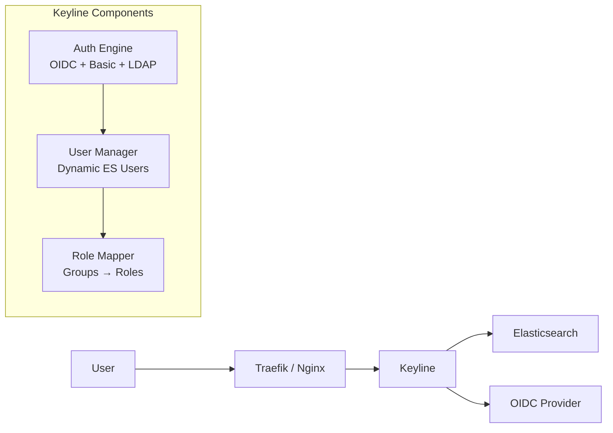

# Keyline

**Successor to elastauth — Modern Authentication Proxy for Elasticsearch**

> 🔐 Full documentation: [wasilak.github.io/keyline](https://wasilak.github.io/keyline/)

Keyline replaces **Authelia + elastauth** with a single service. It inherits elastauth's core innovation—**automatic Elasticsearch user management**—while adding OIDC support, enhanced security, and deployment flexibility.

## Architecture


```mermaid
flowchart LR
    User[User] --> Proxy[Traefik / Nginx]
    Proxy --> Keyline[Keyline]
    
    subgraph Keyline Components
        Auth[Auth Engine<br/>OIDC + Basic + LDAP]
        Mgmt[User Manager<br/>Dynamic ES Users]
        Map[Role Mapper<br/>Groups → Roles]
    end
    
    Keyline --> ES[Elasticsearch]
    Keyline --> OIDC[OIDC Provider]
    
    Auth --> Mgmt
    Mgmt --> Map
```

**What changed from elastauth:**

| elastauth | Keyline |
|-----------|---------|
| LDAP only (via Authelia) | OIDC + Basic Auth (built-in) |
| Two services chained | Single unified proxy |
| Traefik forwardAuth only | Any proxy + standalone |
| Basic caching | Redis + AES-256-GCM encryption |
| Limited observability | Full metrics, tracing, logging |
| No built-in LDAP | LDAP built-in with `ldaps`/`starttls`/`none` TLS modes |

## Quick Start

### Docker (Recommended)

```bash
docker pull ghcr.io/wasilak/keyline:latest
```

### Minimal Configuration

```yaml
server:
  port: 9000
  mode: forward_auth

oidc:
  enabled: true
  issuer_url: https://accounts.google.com
  client_id: ${OIDC_CLIENT_ID}
  client_secret: ${OIDC_CLIENT_SECRET}
  redirect_url: https://auth.yourdomain.com/auth/callback

elasticsearch:
  admin_user: ${ES_ADMIN_USER}
  admin_password: ${ES_ADMIN_PASSWORD}
  url: https://elasticsearch:9200

user_management:
  enabled: true

cache:
  backend: redis
  redis_url: ${REDIS_URL}
  encryption_key: ${CACHE_ENCRYPTION_KEY}  # 32 bytes
```

### Run

```bash
docker run -d \
  --name keyline \
  -p 9000:9000 \
  -v $(pwd)/config.yaml:/etc/keyline/config.yaml \
  -e OIDC_CLIENT_SECRET=... \
  -e ES_ADMIN_PASSWORD=... \
  -e REDIS_URL=... \
  -e CACHE_ENCRYPTION_KEY=$(openssl rand -base64 32) \
  ghcr.io/wasilak/keyline:latest
```

## Why Keyline?

### For elastauth Users

- ✅ **Same core feature** — Automatic ES user creation with role mapping
- ✅ **No more Authelia** — OIDC built-in, single service
- ✅ **Better security** — Encrypted credential cache, PKCE
- ✅ **More flexible** — Works with any reverse proxy
- ✅ **Better observability** — Prometheus, OpenTelemetry, structured logging

### For New Users

- ✅ **Zero ES user setup** — Users created automatically on first auth
- ✅ **Audit-ready** — Real usernames in ES audit logs (no shared accounts)
- ✅ **Hybrid auth** — OIDC for humans, Basic Auth for scripts
- ✅ **Production-ready** — Health checks, metrics, graceful shutdown

## Key Features

- 🔑 **Dual Auth** — OIDC for browsers, Basic Auth for scripts (both work simultaneously)
- 👥 **Dynamic User Management** — Automatic Elasticsearch user creation and updates on every authenticated request; each user gets their own ES account via `user_management` config
- 🔒 **LDAP Authentication** — Built-in LDAP/Active Directory support with three TLS modes (`ldap.tls_mode`: `ldaps`, `starttls`, `none`); coexists with local users and OIDC
- 🗺️ **Role Mapping** — Pattern-based group-to-role mapping via `role_mappings`; supports wildcards, multiple groups, and configurable default roles via `default_es_roles`
- 🔐 **Encrypted Credential Cache** — AES-256-GCM encryption for cached ES credentials (`cache.encryption_key`); Redis backend for horizontal scaling (`session.backend`)
- 🔄 **Any Proxy** — Traefik, Nginx, HAProxy, or standalone mode
- 📈 **Horizontal Scaling** — Redis-backed sessions for multi-instance deployments
- 🛡️ **Circuit Breaker** — Configurable concurrent-request limit via `server.max_concurrent`; returns 503 when exceeded, protecting the ES cluster
- 🌐 **CORS** — Configurable allowed origins via `server.cors.allowed_origins` for cross-origin browser requests
- 🔏 **Env-var Enforcement** — Sensitive fields (`client_secret`, `bind_password`, `encryption_key`) must use `${ENV_VAR}` references; plaintext values are rejected
- 📊 **Observability** — Prometheus metrics, OpenTelemetry tracing, structured logging

## Documentation

Full guides available at [wasilak.github.io/keyline](https://wasilak.github.io/keyline/):

- [Getting Started](https://wasilak.github.io/keyline/docs/getting-started/about)
- [Migration from elastauth](https://wasilak.github.io/keyline/docs/getting-started/migration-from-elastauth)
- [Configuration Reference](https://wasilak.github.io/keyline/docs/configuration)
- [Deployment Guides](https://wasilak.github.io/keyline/docs/deployment/docker)
- [Troubleshooting](https://wasilak.github.io/keyline/docs/troubleshooting)

## Development

```bash
# Build
task build

# Test
task test

# Run
./keyline --config config.yaml
```

## License

MIT License
