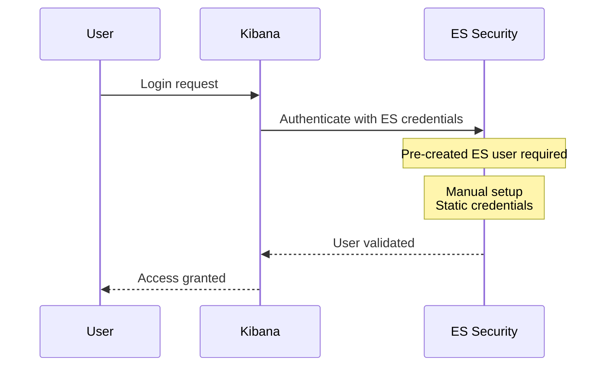
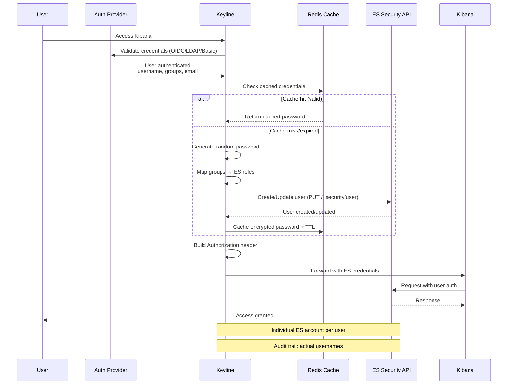
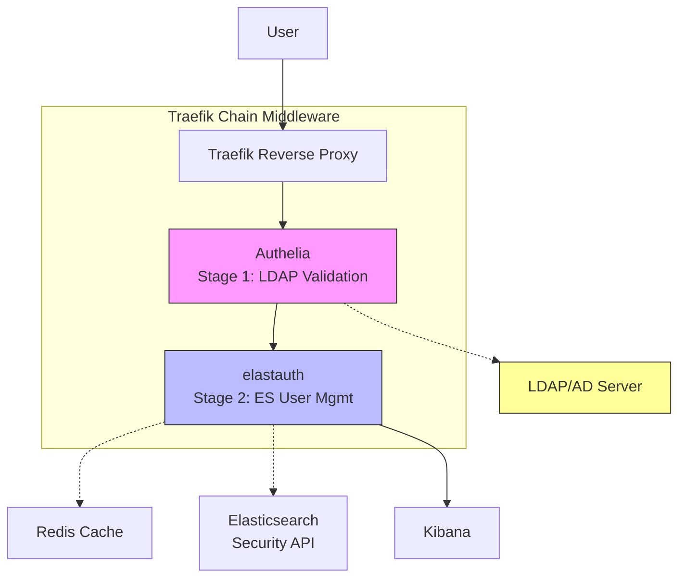
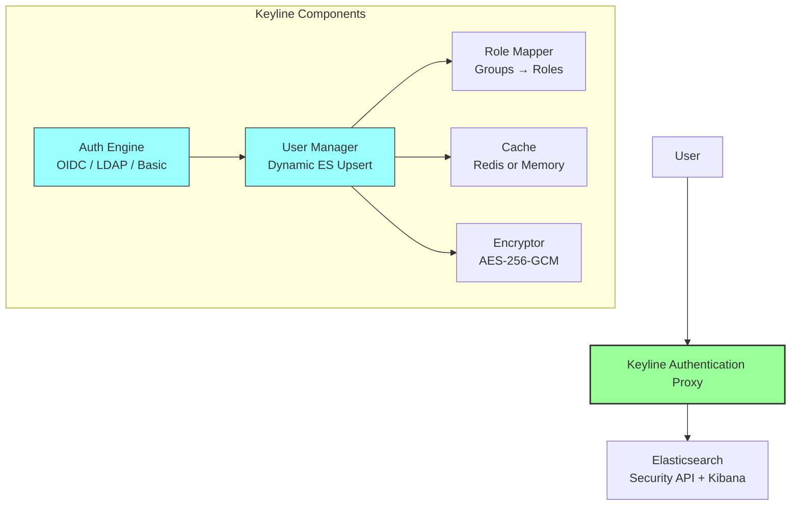

# Keyline: The Evolution from Elastauth

## Overview

Keyline is the next-generation authentication proxy for Elasticsearch, designed as the successor to [elastauth](https://github.com/wasilak/elastauth). It inherits elastauth's core innovation—**transparent Elasticsearch user upsert**—while significantly expanding capabilities, security, and deployment flexibility.

## The Core Innovation: Transparent User Upsert

Both elastauth and Keyline solve the same fundamental problem: **enabling enterprise authentication for Elasticsearch without requiring pre-created ES users**.

### Traditional ES Security (Before)



**Problems:**
- ❌ Manual ES user creation required
- ❌ Static credentials (security risk)
- ❌ No integration with existing identity providers
- ❌ Shared accounts = no audit trail

### Elastauth/Keyline Approach (After)



**Benefits:**
- ✅ No manual ES user setup
- ✅ Dynamic, short-lived passwords
- ✅ Individual accountability (real usernames in audit logs)
- ✅ Role-based access control via group mapping

---

## Architecture Comparison

### Elastauth Architecture

Elastauth pioneered the two-stage forwardAuth approach for Traefik:



**Key Characteristics:**
- **Two-stage authentication**: Authelia (LDAP) + elastauth (user mgmt)
- **Traefik-specific**: Uses forwardAuth middleware
- **LDAP-only**: Requires Authelia for LDAP/AD authentication
- **External dependencies**: Authelia + Redis + Elasticsearch

### Keyline Architecture

Keyline consolidates everything into a single, flexible proxy:



**Key Characteristics:**
- **All-in-one**: Single service handles all authentication
- **Proxy-agnostic**: Works with Traefik, Nginx, HAProxy, or standalone
- **Multi-method**: OIDC, LDAP, Basic Auth (local users)
- **Flexible caching**: Redis (distributed) or in-memory (single-node)

---

## Feature Comparison Matrix

| Feature | Elastauth | Keyline | Status |
|---------|-----------|---------|--------|
| **Authentication Methods** |
| LDAP/Active Directory | ✅ (via Authelia) | ✅ (native) | ✅ Enhanced |
| OIDC (Google, Azure AD, Okta) | ❌ | ✅ | ✅ New |
| Local Users (Basic Auth) | ❌ | ✅ | ✅ New |
| **Architecture** |
| Deployment Model | Two-stage (Authelia + elastauth) | Single-stage (all-in-one) | ✅ Simplified |
| Reverse Proxy Support | Traefik only | Any (Traefik, Nginx, HAProxy, standalone) | ✅ Flexible |
| **User Management** |
| Dynamic ES User Creation | ✅ (LDAP users only) | ✅ (ALL auth methods) | ✅ Enhanced |
| Credential Caching | Redis | Redis or in-memory | ✅ Enhanced |
| Password Security | Random passwords | AES-256-GCM encrypted cache | ✅ Enhanced |
| **Role Mapping** |
| Group-to-Role Mapping | Basic (exact match) | Advanced (wildcards, patterns, email-based) | ✅ Enhanced |
| Multiple Groups → Multiple Roles | ❌ | ✅ | ✅ New |
| Default Roles (fallback) | ❌ | ✅ | ✅ New |
| **Observability** |
| Logging | Basic | Structured (loggergo) | ✅ Enhanced |
| Distributed Tracing | ❌ | OpenTelemetry (otelgo) | ✅ New |
| Metrics | ❌ | Prometheus | ✅ New |
| **Security** |
| TLS Support | ✅ | ✅ | ✅ Parity |
| Password Encryption in Cache | ❌ | ✅ (AES-256-GCM) | ✅ New |
| Circuit Breaker | ❌ | ✅ | ✅ New |
| **Deployment** |
| Docker | ✅ | ✅ | ✅ Parity |
| Binary | ❌ | ✅ | ✅ New |
| Kubernetes-ready | ⚠️ Manual | ✅ | ✅ Enhanced |

---

## Migration Path: Elastauth → Keyline

### What Stays the Same

✅ **Core behavior**: Transparent ES user upsert  
✅ **Cache strategy**: Redis with TTL-based expiry  
✅ **Security model**: Short-lived, randomly generated passwords  
✅ **Audit benefits**: Individual usernames in ES logs  

### What Changes

🔄 **Configuration**: Single config file instead of Authelia + elastauth  
🔄 **Deployment**: One container instead of two  
🔄 **Authentication**: Add OIDC/local users alongside LDAP  
🔄 **Role mapping**: More flexible pattern matching  

### Configuration Mapping

| Elastauth Concept | Keyline Equivalent |
|-------------------|-------------------|
| `config.yml` (elastauth) | `config.yaml` (Keyline) |
| Authelia LDAP config | `local_users` or external LDAP provider |
| `role_mapping` | `role_mappings` (enhanced syntax) |
| Redis cache config | `cache` section (Redis or memory) |
| Traefik forwardAuth | Works with any forward auth or standalone |

---

## Use Cases

### Use Case 1: Small Team with Google Workspace

**Before (Elastauth)**: Not possible (no OIDC support)  
**With Keyline**: OIDC authentication with Google Workspace groups → ES roles

```yaml
oidc:
  enabled: true
  issuer_url: https://accounts.google.com
  client_id: ${GOOGLE_CLIENT_ID}
  client_secret: ${GOOGLE_CLIENT_SECRET}

role_mappings:
  - claim: groups
    pattern: "*-developers"
    es_roles:
      - developer
      - kibana_user

default_es_roles:
  - viewer
```

### Use Case 2: Enterprise with Active Directory

**Before (Elastauth)**: Works, but requires Authelia setup  
**With Keyline**: Same functionality, simpler deployment

```yaml
local_users:
  enabled: true
  users:
    - username: admin
      password_bcrypt: ${ADMIN_PASSWORD_BCRYPT}
      groups:
        - admin
        - superusers

role_mappings:
  - claim: groups
    pattern: "admin"
    es_roles:
      - superuser
```

### Use Case 3: Multi-Cluster with Horizontal Scaling

**Before (Elastauth)**: Redis required for caching  
**With Keyline**: Redis for shared cache across instances

```yaml
cache:
  backend: redis  # Shared across Keyline instances
  redis_url: redis://redis-cluster:6379
  credential_ttl: 1h
  encryption_key: ${CACHE_ENCRYPTION_KEY}  # Same key for all instances
```

---

## Testing Keyline

### Quick Start with Docker Compose

Keyline includes multiple Docker Compose configurations for different scenarios:

| File | Purpose | Auth Method |
|------|---------|-------------|
| `docker-compose.yml` | Basic setup | Local users |
| `docker-compose-forwardauth.yml` | Forward auth mode | Local users |
| `docker-compose-oidc.yml` | OIDC authentication | OIDC provider |
| `docker-compose-oidc-forwardauth.yml` | OIDC + forward auth | OIDC provider |

### Testing Scenarios

#### Scenario 1: Local Users (Basic Auth)

```bash
# Start Keyline with local users
docker-compose -f docker-compose.yml up

# Test authentication
curl -v http://localhost:8080/_security/user \
  -u "testuser:testpassword"
```

#### Scenario 2: OIDC Authentication

```bash
# Start Keyline with OIDC (requires OIDC provider)
docker-compose -f docker-compose-oidc.yml up

# Open browser to http://localhost:8080
# Authenticate via OIDC provider
# Verify ES user created with mapped roles
```

#### Scenario 3: Forward Auth Mode (Traefik Integration)

```bash
# Start Keyline in forward auth mode
docker-compose -f docker-compose-forwardauth.yml up

# Traefik will forward auth requests to Keyline
# Keyline validates and returns ES credentials
```

### Verification Checklist

After testing, verify:

- [ ] Users authenticate successfully
- [ ] ES users are created dynamically (check ES Security API)
- [ ] Groups map to ES roles correctly
- [ ] Credentials are cached (subsequent requests are faster)
- [ ] ES audit logs show actual usernames (not shared accounts)
- [ ] Metrics are exposed (Prometheus endpoint)
- [ ] Traces are visible (if OpenTelemetry enabled)

---

## Key Benefits Summary

### For Developers

✅ **Simpler setup**: One service instead of two  
✅ **Better docs**: Comprehensive documentation  
✅ **More options**: OIDC, LDAP, or local users  
✅ **Better debugging**: Structured logs + tracing  

### For Operations

✅ **Fewer moving parts**: No Authelia dependency  
✅ **Horizontal scaling**: Redis-backed cache  
✅ **Observability**: Metrics, traces, logs  
✅ **Security**: Encrypted credentials, circuit breaker  

### For Security Teams

✅ **Audit trail**: Individual ES accounts per user  
✅ **Short-lived credentials**: Auto-regenerated passwords  
✅ **Encryption**: AES-256-GCM in cache  
✅ **Compliance**: Full accountability  

---

## Conclusion

Keyline represents the **natural evolution of elastauth**:

1. **Preserves the core innovation**: Transparent ES user upsert
2. **Removes limitations**: No Authelia dependency, multi-auth support
3. **Adds modern features**: OIDC, observability, encryption
4. **Improves deployment**: Single binary, flexible proxy integration

For teams using elastauth, Keyline offers a **straightforward migration path** with significant benefits. For new deployments, Keyline provides a **modern, production-ready authentication proxy** for Elasticsearch.

---

## References

- **Elastauth Repository**: https://github.com/wasilak/elastauth
- **Keyline Repository**: https://github.com/yourusername/keyline
- **Elasticsearch Security API**: https://www.elastic.co/guide/en/elasticsearch/reference/current/security-api.html
- **Traefik ForwardAuth**: https://doc.traefik.io/traefik/middlewares/http/forwardauth/
