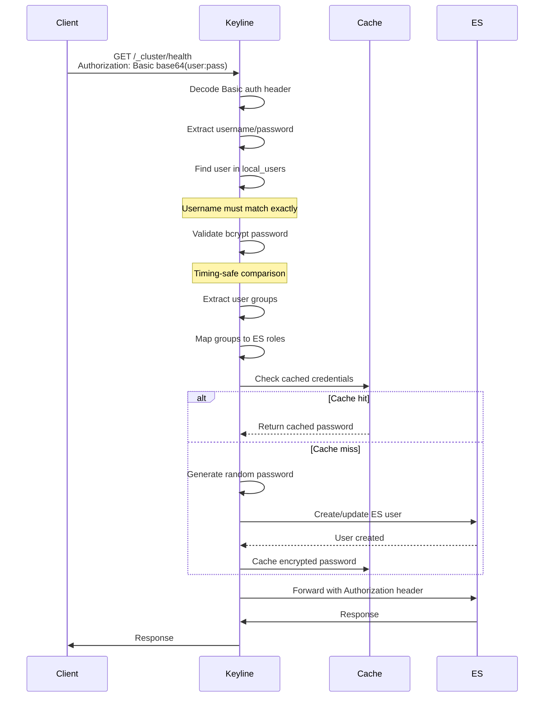

# Local Users (Basic Auth)

Basic Authentication provides programmatic access for CI/CD pipelines, monitoring tools, and API clients. This guide covers local user configuration and best practices.

## Overview

Local users are defined in Keyline configuration and authenticate using HTTP Basic Auth. Unlike OIDC users, local users do not create sessions - each request includes credentials.

## Configuration

### Basic Configuration

```yaml
local_users:
  enabled: true
  users:
    - username: ci-pipeline
      password_bcrypt: ${CI_PASSWORD_BCRYPT}
      groups:
        - ci
      email: ci@example.com
      full_name: CI Pipeline
```

### Configuration Options

| Option | Required | Description |
|--------|----------|-------------|
| `enabled` | No | Enable local user authentication (default: false) |
| `users` | Yes (if enabled) | Array of user definitions |

### User Definition

| Option | Required | Description |
|--------|----------|-------------|
| `username` | Yes | Unique username |
| `password_bcrypt` | Yes | Bcrypt-hashed password |
| `groups` | No | User groups for role mapping |
| `email` | No | User email address |
| `full_name` | No | User display name |

## Generating Bcrypt Passwords

### Using htpasswd (Recommended)

```bash
# Generate bcrypt hash (cost factor 10)
htpasswd -bnBC 10 "" your-password | tr -d ':\n'

# Example output:
# $2y$10$nK4h5MH0MAIzd.R1wZFrUOrYoPiCdXRc3LACW0vByWWGS6LbQHlce
```

### Using OpenSSL

```bash
# OpenSSL bcrypt
openssl passwd -bcrypt your-password
```

### Using Python

```python
import bcrypt
password = "your-password".encode('utf-8')
hashed = bcrypt.hashpw(password, bcrypt.gensalt(rounds=10))
print(hashed.decode('utf-8'))
```

### Using Node.js

```javascript
const bcrypt = require('bcrypt');
const password = 'your-password';
const hash = await bcrypt.hash(password, 10);
console.log(hash);
```

## Example Configurations

### Single Admin User

```yaml
local_users:
  enabled: true
  users:
    - username: admin
      password_bcrypt: ${ADMIN_PASSWORD_BCRYPT}
      groups:
        - admin
        - superusers
      email: admin@example.com
      full_name: Admin User
```

### Multiple Service Accounts

```yaml
local_users:
  enabled: true
  users:
    - username: ci-pipeline
      password_bcrypt: ${CI_PASSWORD_BCRYPT}
      groups:
        - ci
      email: ci@example.com
      full_name: CI Pipeline

    - username: monitoring
      password_bcrypt: ${MONITORING_PASSWORD_BCRYPT}
      groups:
        - monitoring
      email: monitoring@example.com
      full_name: Monitoring Service

    - username: backup-agent
      password_bcrypt: ${BACKUP_PASSWORD_BCRYPT}
      groups:
        - backup
      email: backup@example.com
      full_name: Backup Agent
```

### User with No Groups (Uses Default Roles)

```yaml
local_users:
  enabled: true
  users:
    - username: viewer
      password_bcrypt: ${VIEWER_PASSWORD_BCRYPT}
      email: viewer@example.com
      full_name: Viewer User
      # No groups - will use default_es_roles
```

## Authentication Flow



## Role Mapping Integration

Local user groups are mapped to Elasticsearch roles using `role_mappings`:

```yaml
local_users:
  enabled: true
  users:
    - username: developer
      password_bcrypt: ${DEV_PASSWORD_BCRYPT}
      groups:
        - developers
        - users

role_mappings:
  - claim: groups
    pattern: "developers"
    es_roles:
      - developer
      - kibana_user

  - claim: groups
    pattern: "users"
    es_roles:
      - user

default_es_roles:
  - viewer
```

**Evaluation Logic:**
1. User `developer` has groups: `["developers", "users"]`
2. Both groups match role_mappings
3. User gets ES roles: `["developer", "kibana_user", "user"]`
4. Elasticsearch handles multiple roles natively

## Security Best Practices

### Password Requirements

| Requirement | Recommendation |
|-------------|----------------|
| **Length** | Minimum 16 characters |
| **Complexity** | Mix of uppercase, lowercase, numbers, symbols |
| **Rotation** | Rotate every 90 days |
| **Storage** | Store in secrets manager (Vault, AWS Secrets Manager) |

### Bcrypt Configuration

| Setting | Recommended | Purpose |
|---------|-------------|---------|
| **Cost Factor** | 10-12 | Higher = more secure but slower |
| **Algorithm** | 2y or 2b | Use modern bcrypt variant |

### Environment Variables

Never store plaintext passwords in config files:

```yaml
# ❌ BAD: Plaintext password in config
local_users:
  users:
    - username: admin
      password_bcrypt: "$2y$10$..."  # Don't commit hashes to git!

# ✅ GOOD: Environment variable substitution
local_users:
  users:
    - username: admin
      password_bcrypt: ${ADMIN_PASSWORD_BCRYPT}
```

### Service Account Guidelines

1. **Use descriptive usernames**: `ci-pipeline`, `monitoring`, `backup-agent`
2. **Limit permissions**: Assign only required roles
3. **Rotate regularly**: Automate password rotation
4. **Audit usage**: Monitor service account activity
5. **Use separate accounts**: Don't share service accounts

## Testing Authentication

### Using curl

```bash
# Test Basic Auth
curl -u ci-pipeline:password http://localhost:9000/_cluster/health?pretty

# Expected response:
# {
#   "cluster_name": "keyline-cluster",
#   "status": "green",
#   ...
# }
```

### Using HTTPie

```bash
http --auth ci-pipeline:password http://localhost:9000/_cluster/health
```

### Using Python

```python
import requests
from requests.auth import HTTPBasicAuth

response = requests.get(
    'http://localhost:9000/_cluster/health',
    auth=HTTPBasicAuth('ci-pipeline', 'password')
)
print(response.json())
```

## Troubleshooting

### 401 Unauthorized

**Error**: `401 Unauthorized` with `WWW-Authenticate: Basic realm="Keyline"`

**Causes**:
- Invalid username or password
- User not found in `local_users`
- Bcrypt hash corrupted

**Solution**:
1. Verify username matches exactly (case-sensitive)
2. Regenerate bcrypt hash
3. Check environment variable substitution

### User Not Found

**Error**: `No matching username found`

**Solution**:
1. Verify `local_users.enabled` is `true`
2. Check user is defined in config
3. Validate YAML syntax

### Bcrypt Validation Failed

**Error**: `Invalid bcrypt hash`

**Solution**:
1. Ensure hash starts with `$2y$` or `$2a$`
2. Verify hash is complete (60 characters)
3. Regenerate with cost factor 10-12

## Next Steps

- **[Session Management](./session-management.md)** - Session configuration for OIDC users
- **[Role Mappings](../user-management/role-mappings.md)** - Map groups to ES roles
- **[Troubleshooting](../troubleshooting.md)** - Common authentication issues
