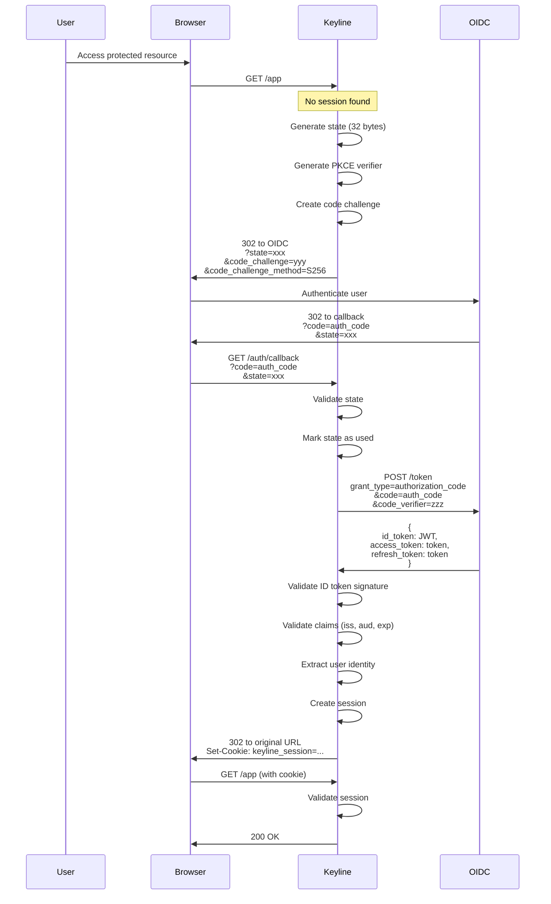

# OIDC Authentication

OpenID Connect (OIDC) provides interactive browser authentication with single sign-on (SSO) capabilities. This guide covers OIDC setup, configuration, and troubleshooting.

## Overview

Keyline implements the OIDC Authorization Code Flow with PKCE (Proof Key for Code Exchange) for secure authentication. This flow is suitable for public clients (browser-based applications).

## Supported OIDC Providers

Keyline works with any OIDC-compliant identity provider including:

- Google Workspace
- Azure AD (Entra ID)
- Okta
- Auth0
- Keycloak
- Any generic OIDC provider

See [Provider Setup Guides](#provider-setup-guides) for configuration examples.

## Configuration

### Basic OIDC Configuration

```yaml
oidc:
  enabled: true
  issuer_url: https://accounts.google.com
  client_id: ${OIDC_CLIENT_ID}
  client_secret: ${OIDC_CLIENT_SECRET}
  redirect_url: https://auth.example.com/auth/callback
  scopes:
    - openid
    - email
    - profile
  user_identity_claim: email
```

### Configuration Options

| Option | Required | Description |
|--------|----------|-------------|
| `enabled` | No | Enable OIDC authentication (default: false) |
| `issuer_url` | Yes (if enabled) | OIDC provider issuer URL (must be HTTPS) |
| `client_id` | Yes (if enabled) | OAuth2 client ID |
| `client_secret` | Yes (if enabled) | OAuth2 client secret |
| `redirect_url` | Yes (if enabled) | OAuth2 callback URL (must be HTTPS) |
| `scopes` | No | OAuth2 scopes to request (default: openid, email, profile) |
| `user_identity_claim` | No | Claim to use as ES username (default: email) |

## OIDC Flow with PKCE

### Step-by-Step Flow



### Security Features

| Feature | Purpose |
|---------|---------|
| **State Token** | CSRF protection, single-use, 5-minute TTL |
| **PKCE** | Prevents authorization code interception |
| **ID Token Validation** | Signature, issuer, audience, expiration |
| **JWKS Cache** | Public key caching with 24h refresh |

## Provider Setup Guides

### Google Workspace Setup

#### Step 1: Create OAuth2 Credentials

1. Go to [Google Cloud Console](https://console.cloud.google.com/)
2. Create a new project or select existing
3. Enable "Google+ API"
4. Go to "Credentials" → "Create Credentials" → "OAuth2 Client ID"
5. Application type: **Web application**
6. Add authorized redirect URI: `https://auth.example.com/auth/callback`
7. Note the **Client ID** and **Client Secret**

#### Step 2: Configure Keyline

```yaml
oidc:
  enabled: true
  issuer_url: https://accounts.google.com
  client_id: 123456789-abc123def456.apps.googleusercontent.com
  client_secret: ${GOOGLE_CLIENT_SECRET}
  redirect_url: https://auth.example.com/auth/callback
  scopes:
    - openid
    - email
    - profile
  user_identity_claim: email
```

#### Step 3: Configure Domain-Wide Delegation (Optional)

For Google Workspace domains, you can restrict access by domain:

```yaml
oidc:
  # ... other config
  hd: example.com  # Hosted domain restriction
```

### Azure AD (Entra ID) Setup

#### Step 1: Register Application

1. Go to [Azure Portal](https://portal.azure.com/)
2. Navigate to "Azure Active Directory" → "App registrations"
3. Click "New registration"
4. Name: `Keyline`
5. Supported account types: **Accounts in this organizational directory only**
6. Redirect URI: `https://auth.example.com/auth/callback` (Platform: Web)
7. Click "Register"

#### Step 2: Configure Authentication

1. In app registration, go to "Authentication"
2. Under "Implicit grant", check:
   - ID tokens (used for implicit flow)
3. Click "Save"

#### Step 3: Create Client Secret

1. Go to "Certificates & secrets"
2. Click "New client secret"
3. Description: `Keyline Secret`
4. Expires: Choose duration
5. Click "Add"
6. **Copy the secret value immediately** (won't be shown again)

#### Step 4: Configure Keyline

```yaml
oidc:
  enabled: true
  issuer_url: https://login.microsoftonline.com/{tenant-id}/v2.0
  client_id: ${AZURE_CLIENT_ID}
  client_secret: ${AZURE_CLIENT_SECRET}
  redirect_url: https://auth.example.com/auth/callback
  scopes:
    - openid
    - email
    - profile
    - offline_access
  user_identity_claim: email
```

### Okta Setup

#### Step 1: Create Application

1. Go to [Okta Admin Console](https://{your-org}.okta.com/)
2. Navigate to "Applications" → "Create App Integration"
3. Sign-in method: **OIDC - OpenID Connect**
4. Application type: **Web application**
5. Click "Next"

#### Step 2: Configure Application

- Application name: `Keyline`
- Grant type: **Authorization Code**
- Sign-in redirect URI: `https://auth.example.com/auth/callback`
- Sign-out redirect URI: `https://auth.example.com/auth/logout`

#### Step 3: Configure Keyline

```yaml
oidc:
  enabled: true
  issuer_url: https://{your-org}.okta.com/oauth2/default
  client_id: ${OKTA_CLIENT_ID}
  client_secret: ${OKTA_CLIENT_SECRET}
  redirect_url: https://auth.example.com/auth/callback
  scopes:
    - openid
    - email
    - profile
    - groups
  user_identity_claim: email
```

## Claim Mapping

### Extract User Identity

The `user_identity_claim` determines which claim becomes the ES username:

```yaml
oidc:
  user_identity_claim: email  # Common choices: email, sub, preferred_username
```

### Common Claims

| Claim | Description | Example |
|-------|-------------|---------|
| `sub` | Unique identifier | `1234567890` |
| `email` | Email address | `user@example.com` |
| `preferred_username` | Display username | `john.doe` |
| `name` | Full name | `John Doe` |
| `groups` | Group memberships | `["admin", "users"]` |

## Troubleshooting

### Discovery Document Fetch Failed

**Error**: `Failed to fetch OIDC discovery document`

**Solution**:
1. Verify `issuer_url` is correct and accessible
2. Check network connectivity from Keyline to OIDC provider
3. Test discovery endpoint manually:
   ```bash
   curl https://accounts.google.com/.well-known/openid-configuration
   ```

### Redirect URI Mismatch

**Error**: `Redirect URI mismatch` from OIDC provider

**Solution**:
1. Verify `redirect_url` exactly matches configured URI in OIDC provider
2. Ensure HTTPS is used (required by most providers)
3. Check for trailing slashes

### Invalid State Token

**Error**: `Invalid or expired state token`

**Solution**:
1. Check session storage is working (Redis/memory)
2. Verify `session_secret` is configured
3. Ensure cookies are being transmitted correctly

### ID Token Validation Failed

**Error**: `Invalid token signature` or `Invalid token claims`

**Solution**:
1. Verify `issuer_url` matches the `iss` claim
2. Verify `client_id` matches the `aud` claim
3. Check system time is synchronized (NTP)
4. Test JWKS endpoint accessibility

## Next Steps

- **[Local Users (Basic Auth)](./local-users-basic-auth.md)** - Configure Basic Authentication
- **[Session Management](./session-management.md)** - Session storage configuration
- **[Role Mappings](../user-management/role-mappings.md)** - Map OIDC claims to ES roles
