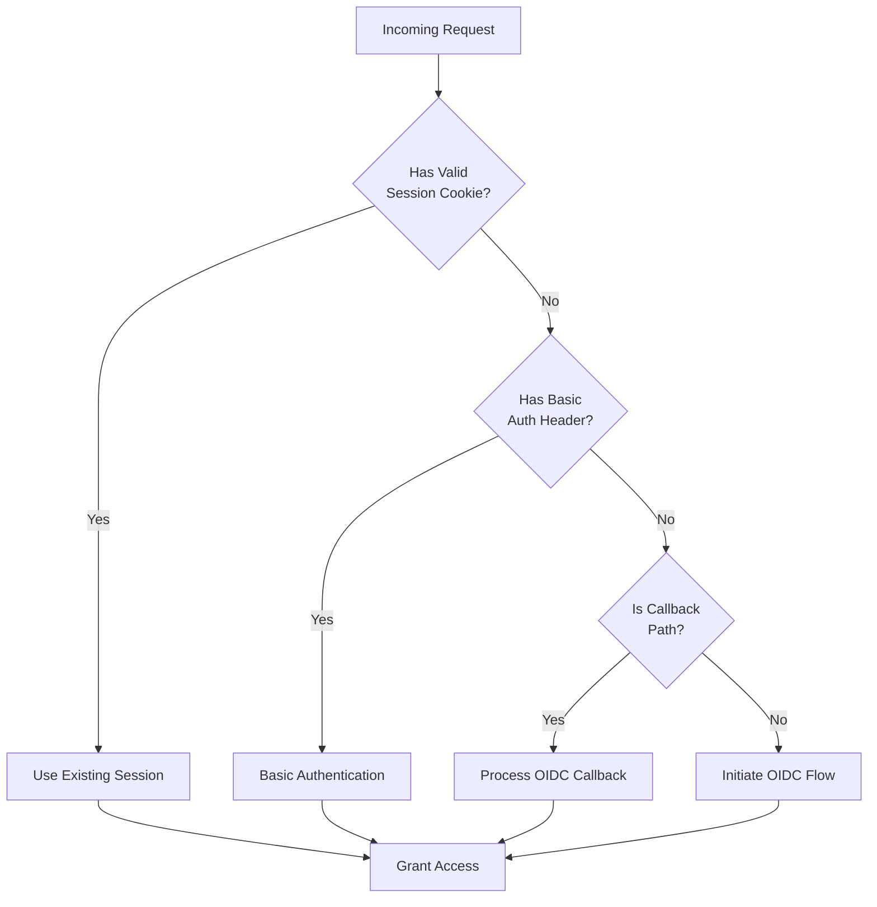
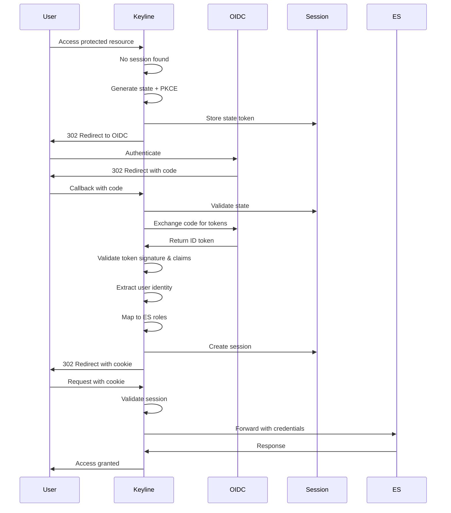
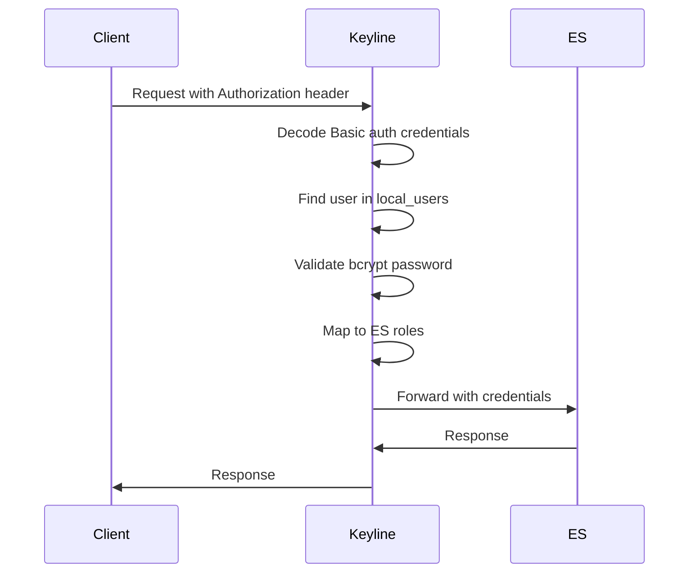

# Authentication Overview

Keyline supports dual authentication methods simultaneously: **OIDC (OpenID Connect)** for interactive browser users and **Basic Auth** for programmatic access. This guide provides an overview of both authentication methods and how Keyline handles them.

## Supported Authentication Methods

| Method | Use Case | Session | Best For |
|--------|----------|---------|----------|
| **OIDC** | Interactive browser authentication | Yes (cookie-based) | Human users, SSO |
| **Basic Auth** | Programmatic/API access | No (stateless) | CI/CD, monitoring, scripts |

## Dual Authentication Architecture

Keyline automatically selects the appropriate authentication method based on the incoming request:



## Authentication Flow Comparison

### OIDC Flow (Interactive Users)



### Basic Auth Flow (Programmatic Access)



## Key Security Features

### OIDC Security

| Feature | Purpose |
|---------|---------|
| **PKCE** | Prevents authorization code interception attacks |
| **State Token** | CSRF protection, single-use, 5-minute TTL |
| **ID Token Validation** | Signature, issuer, audience, expiration checks |
| **JWKS Rotation** | Automatic key refresh every 24 hours |
| **Secure Cookies** | HttpOnly, Secure, SameSite=Lax attributes |

### Basic Auth Security

| Feature | Purpose |
|---------|---------|
| **Bcrypt Hashing** | Timing-safe password comparison |
| **No Session Storage** | Stateless authentication |
| **WWW-Authenticate Header** | Proper 401 response for failed auth |
| **No Plaintext Logging** | Credentials never logged |

## Session Management

### Cookie-Based Sessions (OIDC)

| Attribute | Value | Purpose |
|-----------|-------|---------|
| `HttpOnly` | `true` | Prevents JavaScript access (XSS protection) |
| `Secure` | `true` | Requires HTTPS transmission |
| `SameSite` | `Lax` | Prevents CSRF attacks |
| `Max-Age` | Configurable (default: 24h) | Session TTL |

### Session Storage Backends

| Backend | Use Case | Pros | Cons |
|---------|----------|------|------|
| **Memory** | Development, single-node | Simple, no dependencies | Lost on restart, no scaling |
| **Redis** | Production, multi-node | Persistent, scalable | Requires Redis infrastructure |

## Configuration Summary

### OIDC Configuration

```yaml
oidc:
  enabled: true
  issuer_url: https://accounts.google.com
  client_id: ${OIDC_CLIENT_ID}
  client_secret: ${OIDC_CLIENT_SECRET}
  redirect_url: https://auth.example.com/auth/callback
  scopes:
    - openid
    - email
    - profile
```

### Basic Auth Configuration

```yaml
local_users:
  enabled: true
  users:
    - username: ci-pipeline
      password_bcrypt: ${CI_PASSWORD_BCRYPT}
      groups:
        - ci
      email: ci@example.com
      full_name: CI Pipeline
```

### Session Configuration

```yaml
session:
  ttl: 24h
  cookie_name: keyline_session
  cookie_domain: .example.com
  session_secret: ${SESSION_SECRET}  # Min 32 bytes
```

## Authentication Endpoints

| Endpoint | Method | Purpose |
|----------|--------|---------|
| `/_auth` | GET | ForwardAuth validation endpoint |
| `/auth/callback` | GET | OIDC callback handler |
| `/auth/logout` | GET/POST | Session logout |
| `/*` | ANY | Protected resources |

## Next Steps

- **[OIDC Authentication](./oidc-authentication.md)** - Detailed OIDC setup and configuration
- **[Local Users (Basic Auth)](./local-users-basic-auth.md)** - Configure Basic Authentication
- **[Session Management](./session-management.md)** - Session storage and configuration
- **[Logout](./logout.md)** - Session termination and OIDC logout
