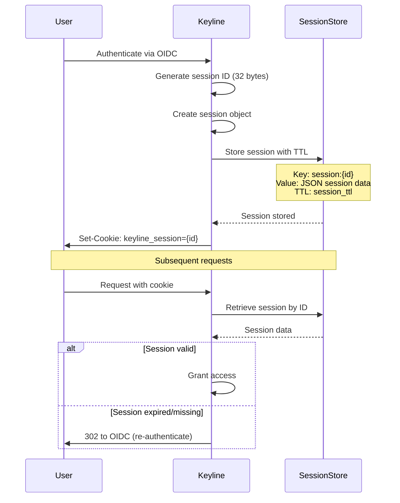

# Session Management

Keyline provides flexible session management with support for both in-memory and Redis backends. This guide covers session configuration, storage options, and best practices.

## Overview

Sessions are created for OIDC-authenticated users to maintain authentication state across requests. Basic Auth users do not create sessions (stateless authentication).

## Session Lifecycle



## Configuration

### Basic Session Configuration

```yaml
session:
  ttl: 24h
  cookie_name: keyline_session
  cookie_domain: .example.com
  cookie_path: /
  session_secret: ${SESSION_SECRET}
```

### Configuration Options

| Option | Required | Default | Description |
|--------|----------|---------|-------------|
| `ttl` | No | 24h | Session time-to-live |
| `cookie_name` | No | keyline_session | Session cookie name |
| `cookie_domain` | Yes* | - | Cookie domain (*required for production) |
| `cookie_path` | No | / | Cookie path |
| `session_secret` | Yes | - | Secret for cookie signing (min 32 bytes) |

## Storage Backends

### In-Memory Storage

**Use Case**: Development, testing, single-node deployments

```yaml
session:
  ttl: 24h
  cookie_name: keyline_session
  session_secret: ${SESSION_SECRET}
```

**Pros:**
- Simple configuration
- No external dependencies
- Fast access

**Cons:**
- Sessions lost on restart
- No horizontal scaling
- Memory grows with active users

### Redis Storage

**Use Case**: Production, multi-node deployments, high availability

```yaml
session:
  ttl: 24h
  cookie_name: keyline_session
  session_secret: ${SESSION_SECRET}

cache:
  backend: redis
  redis_url: redis://localhost:6379
  redis_password: ${REDIS_PASSWORD}
  redis_db: 0
```

**Pros:**
- Persistent across restarts
- Horizontal scaling support
- Shared session store
- Automatic TTL management

**Cons:**
- Requires Redis infrastructure
- Network latency
- Additional failure point

## Cookie Security

### Cookie Attributes

| Attribute | Value | Purpose |
|-----------|-------|---------|
| `HttpOnly` | `true` | Prevents JavaScript access (XSS protection) |
| `Secure` | `true` | Requires HTTPS transmission |
| `SameSite` | `Lax` | Prevents CSRF attacks |
| `Domain` | `.example.com` | Allows subdomain sharing |
| `Path` | `/` | Cookie path scope |
| `Max-Age` | TTL value | Session expiration |

### Generating Session Secret

The `session_secret` is used to sign session cookies. It must be at least 32 bytes.

```bash
# Generate secure session secret
openssl rand -base64 32

# Example output:
# xJ7vK9mN2pQ4rS6tU8vW0xY1zA3bC5dE7fG9hI0jK2l=
```

## Session Data Structure

Sessions store the following information:

```json
{
  "id": "random-32-byte-session-id",
  "user_id": "user@example.com",
  "username": "user@example.com",
  "email": "user@example.com",
  "es_user": "user@example.com",
  "claims": {
    "groups": ["developers", "users"],
    "name": "User Name"
  },
  "created_at": "2024-01-01T00:00:00Z",
  "expires_at": "2024-01-02T00:00:00Z"
}
```

## Session TTL Management

### Recommended TTL Values

| Use Case | TTL | Rationale |
|----------|-----|-----------|
| **Development** | 24h | Convenient for testing |
| **Internal Applications** | 8h | Matches work shift |
| **External Applications** | 1h | Higher security |
| **High Security** | 15m | Minimal exposure window |
| **CI/CD Service Accounts** | N/A | Use Basic Auth (no sessions) |

### TTL Expiration

When a session expires:
1. Session is automatically deleted from storage
2. Next request triggers re-authentication
3. User is redirected to OIDC provider

## Multi-Node Deployments

For horizontal scaling, use Redis as the session backend:

```yaml
# All Keyline instances share same config
session:
  ttl: 24h
  cookie_name: keyline_session
  cookie_domain: .example.com
  session_secret: ${SESSION_SECRET}  # Same secret on all instances

cache:
  backend: redis
  redis_url: redis://redis-cluster:6379
  redis_password: ${REDIS_PASSWORD}  # Same password on all instances
```

**Requirements:**
- All instances must share the same `session_secret`
- All instances must connect to the same Redis cluster
- Cookie domain must be shared across instances

## Session Cleanup

### Automatic Cleanup

Keyline automatically cleans up expired sessions:
- Redis: Automatic via TTL
- Memory: Background goroutine runs every 5 minutes

### Manual Cleanup

#### Redis

```bash
# List all Keyline sessions
redis-cli KEYS "session:*"

# Delete specific session
redis-cli DEL "session:{session-id}"

# Delete all sessions (use with caution!)
redis-cli KEYS "session:*" | xargs redis-cli DEL
```

#### Memory

Restart Keyline to clear all in-memory sessions.

## Monitoring

### Session Metrics

Keyline exposes session-related metrics:

```prometheus
# Sessions created
keyline_session_creates_total

# Sessions validated
keyline_session_validates_total

# Session storage errors
keyline_session_errors_total
```

### Logging

Session events are logged:

```json
{
  "level": "info",
  "message": "Session created",
  "username": "user@example.com",
  "session_id": "abc123...",
  "expires_at": "2024-01-02T00:00:00Z"
}
```

## Troubleshooting

### Session Not Persisting

**Symptoms**: User must re-authenticate on every request

**Causes**:
- Cookie domain mismatch
- Session secret not configured
- Session storage unavailable

**Solution**:
1. Verify `cookie_domain` matches your domain
2. Check `session_secret` is set (min 32 bytes)
3. Test Redis connectivity (if using Redis)

### Session Lost on Restart

**Symptoms**: All users must re-authenticate after Keyline restart

**Cause**: Using in-memory session storage

**Solution**: Switch to Redis backend for persistence

### Cookie Not Set

**Symptoms**: No `Set-Cookie` header in response

**Causes**:
- Authentication failed
- Session creation failed
- Response already committed

**Solution**:
1. Check authentication logs
2. Verify session storage is accessible
3. Review response handling code

### Session Hijacking Attempt

**Symptoms**: Session ID appears in logs or URLs

**Solution**:
1. Rotate `session_secret` immediately
2. Invalidate all sessions
3. Review application for XSS vulnerabilities
4. Ensure `HttpOnly` flag is set

## Security Best Practices

1. **Use HTTPS**: Always enable `Secure` cookie attribute
2. **Strong Secret**: Use 32+ byte session secret
3. **Rotate Secrets**: Periodically rotate `session_secret`
4. **Short TTL**: Use minimum TTL for your use case
5. **Domain Restriction**: Set appropriate `cookie_domain`
6. **Monitor Sessions**: Alert on unusual session patterns

## Next Steps

- **[Logout](./logout.md)** - Session termination
- **[Integrations](../integrations.md)** - Redis setup guide
- **[Security Best Practices](../deployment/security-best-practices.md)** - Security guidelines
