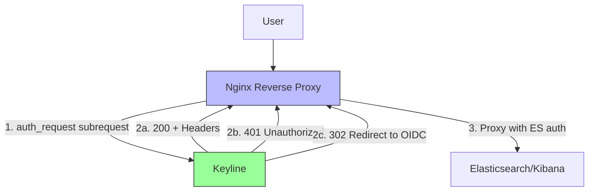
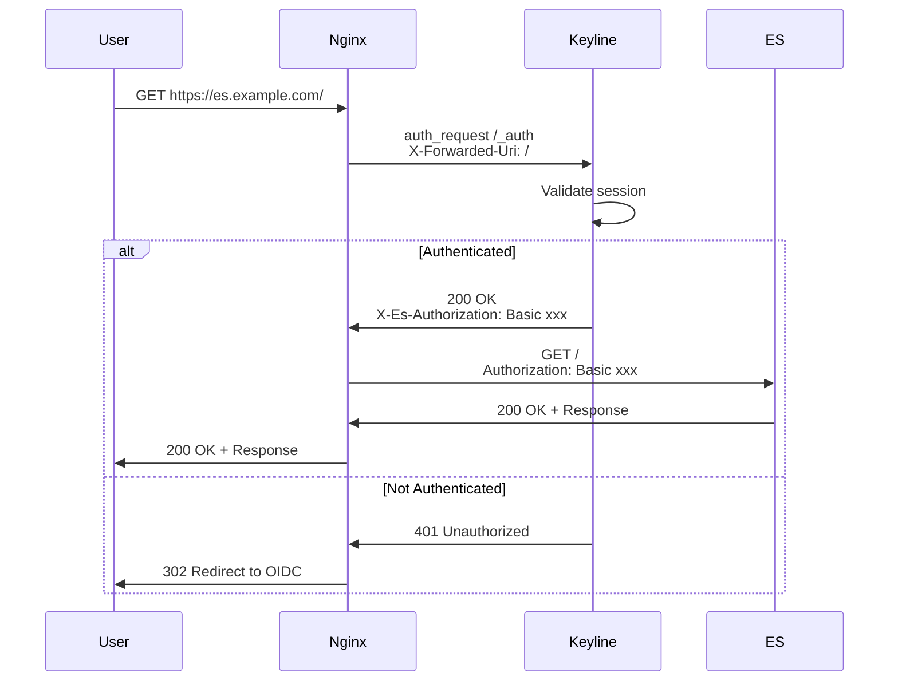

# Auth Request Mode (Nginx)

Auth Request mode integrates Keyline with Nginx reverse proxy for authentication. This guide covers configuration, setup, and troubleshooting.

## Overview

Nginx auth_request module sends subrequests to Keyline for authentication before proxying requests to protected services. Keyline validates authentication and returns success/failure to Nginx.

## Architecture



## Configuration

### Keyline Configuration

```yaml
server:
  port: 9000
  mode: forward_auth
  read_timeout: 30s
  write_timeout: 30s

# Keyline uses forward_auth mode for both Traefik and Nginx
# Nginx auth_request is compatible with forward_auth mode
```

### Nginx Configuration

#### Basic Configuration

```nginx
http {
    # Upstream to Keyline
    upstream keyline {
        server keyline:9000;
    }

    # Upstream to Elasticsearch
    upstream elasticsearch {
        server elasticsearch:9200;
    }

    server {
        listen 80;
        server_name es.example.com;

        location / {
            # Auth request to Keyline
            auth_request /_auth;
            auth_request_set $es_authorization $upstream_http_x_es_authorization;
            
            # Error handling
            error_page 401 =302 /_oauth/signin;

            # Proxy to Elasticsearch
            proxy_pass https://elasticsearch;
            proxy_set_header Authorization $es_authorization;
            proxy_set_header Host $host;
            proxy_set_header X-Real-IP $remote_addr;
        }

        # Internal auth endpoint
        location = /_auth {
            internal;
            proxy_pass http://keyline/auth/verify;
            proxy_pass_request_body off;
            proxy_set_header Content-Length "";
            proxy_set_header X-Forwarded-Uri $request_uri;
            proxy_set_header X-Forwarded-Method $request_method;
            proxy_set_header X-Forwarded-Host $host;
        }

        # OAuth signin redirect
        location = /_oauth/signin {
            return 302 https://accounts.google.com/o/oauth2/auth?...;
        }
    }
}
```

#### Advanced Configuration with Variables

```nginx
http {
    # Map to extract Authorization header from Keyline response
    map $upstream_http_x_es_authorization $es_auth {
        default $upstream_http_x_es_authorization;
        "" "";
    }

    server {
        listen 443 ssl;
        server_name es.example.com;

        ssl_certificate /etc/nginx/ssl/es.example.com.crt;
        ssl_certificate_key /etc/nginx/ssl/es.example.com.key;

        location / {
            # Auth request
            auth_request /_auth;
            auth_request_set $es_authorization $upstream_http_x_es_authorization;
            
            # Handle auth errors
            error_page 401 =302 https://$host/_oauth/signin?rd=$scheme://$host$request_uri;
            error_page 403 =403;

            # Proxy settings
            proxy_pass https://elasticsearch;
            proxy_ssl_verify on;
            proxy_ssl_trusted_certificate /etc/nginx/ssl/ca.crt;
            
            # Forward authorization
            proxy_set_header Authorization $es_authorization;
            proxy_set_header Host $host;
            proxy_set_header X-Real-IP $remote_addr;
            proxy_set_header X-Forwarded-For $proxy_add_x_forwarded_for;
            proxy_set_header X-Forwarded-Proto $scheme;
        }

        location = /_auth {
            internal;
            proxy_pass http://keyline/auth/verify;
            proxy_pass_request_body off;
            proxy_set_header Content-Length "";
            
            # Forward original request info
            proxy_set_header X-Forwarded-Uri $request_uri;
            proxy_set_header X-Forwarded-Method $request_method;
            proxy_set_header X-Forwarded-Host $host;
            proxy_set_header X-Forwarded-Proto $scheme;
            proxy_set_header Cookie $http_cookie;
        }
    }
}
```

## Docker Compose Example

```yaml
version: '3.8'

services:
  nginx:
    image: nginx:alpine
    ports:
      - "80:80"
      - "443:443"
    volumes:
      - ./nginx.conf:/etc/nginx/nginx.conf:ro
      - ./ssl:/etc/nginx/ssl:ro
    depends_on:
      - keyline
    networks:
      - keyline-network

  keyline:
    image: keyline:latest
    volumes:
      - ./config.yaml:/etc/keyline/config.yaml
    environment:
      - SESSION_SECRET=${SESSION_SECRET}
      - CACHE_ENCRYPTION_KEY=${CACHE_ENCRYPTION_KEY}
    command: ["--config", "/etc/keyline/config.yaml"]
    networks:
      - keyline-network

  elasticsearch:
    image: docker.elastic.co/elasticsearch/elasticsearch:9.3.1
    environment:
      - discovery.type=single-node
      - xpack.security.enabled=true
    volumes:
      - es-data:/usr/share/elasticsearch/data
    networks:
      - keyline-network

volumes:
  es-data:

networks:
  keyline-network:
    driver: bridge
```

## Authentication Flow



## Testing

### Test Auth Request Endpoint

```bash
# Test without authentication
curl -v http://localhost/_auth

# Test with Basic Auth
curl -v -u admin:password \
  http://localhost/_auth \
  -H "X-Forwarded-Uri: /" \
  -H "X-Forwarded-Method: GET"
```

### Test Through Nginx

```bash
# Test protected endpoint
curl -v https://es.example.com/

# With authentication
curl -v -u admin:password \
  https://es.example.com/
```

### Test Nginx Configuration

```bash
# Test configuration syntax
nginx -t

# Reload configuration
nginx -s reload
```

## Troubleshooting

### 401 from Keyline

**Symptoms**: Nginx returns 401 to client

**Solution**:
1. Check Keyline logs for auth errors
2. Verify credentials
3. Check session configuration

### 502 Bad Gateway

**Symptoms**: Nginx can't reach Keyline

**Solution**:
```bash
# Check Keyline connectivity
curl http://keyline:9000/healthz

# Check Nginx logs
docker-compose logs nginx
```

### Variables Not Set

**Symptoms**: `$es_authorization` is empty

**Solution**:
```nginx
# Verify auth_request_set directive
auth_request_set $es_authorization $upstream_http_x_es_authorization;

# Check header name matches Keyline response
# Keyline returns: X-Es-Authorization
# Nginx variable: $upstream_http_x_es_authorization
```

## Next Steps

- **[ForwardAuth (Traefik)](./forwardauth-traefik.md)** - Traefik integration
- **[Standalone Proxy](./standalone-proxy.md)** - Standalone mode
- **[Docker Deployment](../deployment/docker.md)** - Docker setup
