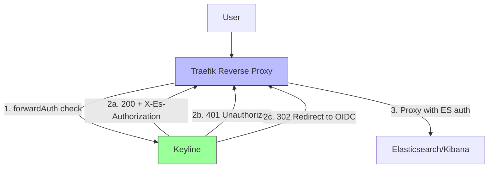
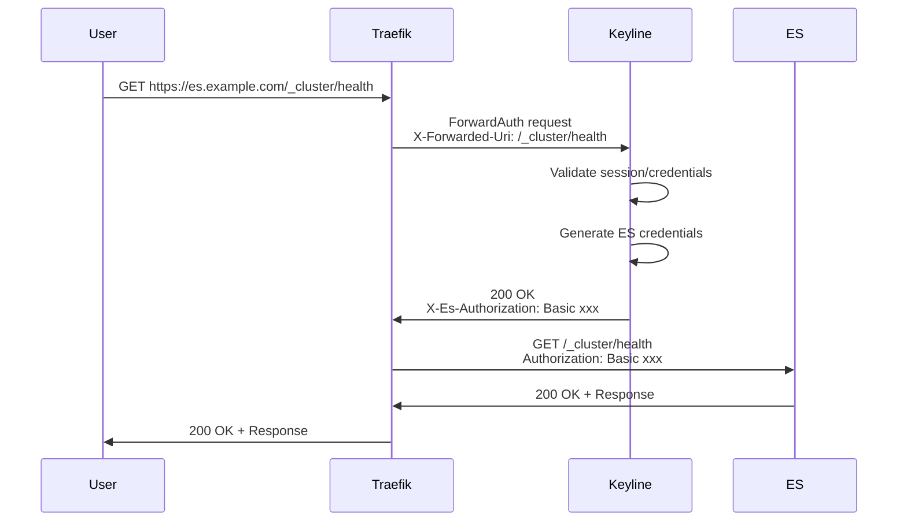

# ForwardAuth Mode (Traefik)

ForwardAuth mode integrates Keyline with Traefik reverse proxy for centralized authentication. This guide covers configuration, setup, and troubleshooting.

## Overview

In ForwardAuth mode, Keyline validates authentication and returns headers to Traefik, which then proxies requests to protected services. Keyline does not proxy requests directly in this mode.

## Architecture



## Configuration

### Keyline Configuration

```yaml
server:
  port: 9000
  mode: forward_auth
  read_timeout: 30s
  write_timeout: 30s

# No upstream configuration needed in forward_auth mode
# upstream: section is ignored
```

### Traefik Configuration

#### Static Configuration (traefik.yaml)

```yaml
api:
  dashboard: true

entryPoints:
  web:
    address: ":80"
  websecure:
    address: ":443"

providers:
  docker:
    endpoint: "unix:///var/run/docker.sock"
    exposedByDefault: false

# Optional: Traefik dashboard
api:
  insecure: true
```

#### Dynamic Configuration (Docker Labels)

```yaml
version: '3.8'

services:
  traefik:
    image: traefik:v3.2
    command:
      - "--api.insecure=true"
      - "--providers.docker=true"
      - "--providers.docker.exposedbydefault=false"
      - "--entrypoints.web.address=:80"
      - "--entrypoints.web.forwardedHeaders.trustedIPs=0.0.0.0/0,::/0"
      - "--serversTransport.insecureSkipVerify=true"
    ports:
      - "80:80"
      - "443:443"
      - "8080:8080"  # Dashboard
    volumes:
      - /var/run/docker.sock:/var/run/docker.sock:ro
    networks:
      - keyline-network

  keyline:
    image: keyline:latest
    environment:
      - SESSION_SECRET=${SESSION_SECRET}
      - CACHE_ENCRYPTION_KEY=${CACHE_ENCRYPTION_KEY}
    volumes:
      - ./config.yaml:/etc/keyline/config.yaml
    command: ["--config", "/etc/keyline/config.yaml"]
    networks:
      - keyline-network
    labels:
      - "traefik.enable=false"  # Don't expose Keyline directly

  elasticsearch:
    image: docker.elastic.co/elasticsearch/elasticsearch:9.3.1
    environment:
      - discovery.type=single-node
      - xpack.security.enabled=true
    volumes:
      - es-data:/usr/share/elasticsearch/data
    networks:
      - keyline-network
    labels:
      - "traefik.enable=true"
      - "traefik.http.routers.elasticsearch.rule=Host(`es.example.com`)"
      - "traefik.http.routers.elasticsearch.entrypoints=websecure"
      - "traefik.http.routers.elasticsearch.tls=true"
      - "traefik.http.routers.elasticsearch.middlewares=keyline-auth"
      - "traefik.http.middlewares.keyline-auth.forwardauth.address=http://keyline:9000/auth/verify"
      - "traefik.http.middlewares.keyline-auth.forwardauth.authResponseHeaders=X-Es-Authorization"
      - "traefik.http.services.elasticsearch.loadbalancer.server.port=9200"
      - "traefik.http.services.elasticsearch.loadbalancer.server.scheme=https"

volumes:
  es-data:

networks:
  keyline-network:
    driver: bridge
```

#### Dynamic Configuration (File Provider)

```yaml
# traefik-dynamic.yaml
http:
  routers:
    elasticsearch:
      rule: "Host(`es.example.com`)"
      entryPoints:
        - websecure
      tls: {}
      middlewares:
        - keyline-auth
      service: elasticsearch

    kibana:
      rule: "Host(`kibana.example.com`)"
      entryPoints:
        - websecure
      tls: {}
      middlewares:
        - keyline-auth
      service: kibana

  middlewares:
    keyline-auth:
      forwardAuth:
        address: "http://keyline:9000/auth/verify"
        authResponseHeaders:
          - "X-Es-Authorization"
        trustForwardHeader: true

  services:
    elasticsearch:
      loadBalancer:
        servers:
          - url: "https://elasticsearch:9200"
        passHostHeader: true

    kibana:
      loadBalancer:
        servers:
          - url: "http://kibana:5601"
        passHostHeader: true
```

## Header Forwarding

### Traefik → Keyline

| Header | Purpose |
|--------|---------|
| `X-Forwarded-Uri` | Original request path |
| `X-Forwarded-Method` | Original HTTP method |
| `X-Forwarded-Host` | Original request host |
| `Cookie` | Session cookies |

### Keyline → Traefik

| Header | Purpose |
|--------|---------|
| `X-Es-Authorization` | Elasticsearch credentials (Basic base64) |

## Authentication Flow



## Testing

### Test ForwardAuth Endpoint

```bash
# Test without authentication (should redirect)
curl -v http://keyline:9000/auth/verify

# Test with Basic Auth
curl -v -u admin:password \
  http://keyline:9000/auth/verify \
  -H "X-Forwarded-Uri: /_cluster/health" \
  -H "X-Forwarded-Method: GET"

# Expected response: 200 OK with X-Es-Authorization header
```

### Test Through Traefik

```bash
# Test protected endpoint
curl -v https://es.example.com/_cluster/health

# With authentication
curl -v -u admin:password \
  https://es.example.com/_cluster/health
```

## Troubleshooting

### 401 Unauthorized from Keyline

**Symptoms**: Traefik returns 401 to client

**Causes**:
- No valid session
- Basic Auth credentials invalid
- Session expired

**Solution**:
1. Check Keyline logs for auth errors
2. Verify credentials are correct
3. Check session configuration

### 502 Bad Gateway

**Symptoms**: Traefik can't reach Keyline

**Causes**:
- Keyline not running
- Network issue
- Wrong Keyline address

**Solution**:
```bash
# Check Keyline health
curl http://keyline:9000/healthz

# Check network connectivity
docker network inspect keyline-network
```

### Headers Not Forwarded

**Symptoms**: ES returns 401 even though Keyline returns 200

**Causes**:
- `authResponseHeaders` not configured
- Header name mismatch

**Solution**:
```yaml
# Verify Traefik configuration
http:
  middlewares:
    keyline-auth:
      forwardAuth:
        authResponseHeaders:
          - "X-Es-Authorization"  # Must match exactly
```

## Next Steps

- **[Auth Request (Nginx)](./auth-request-nginx.md)** - Nginx integration
- **[Standalone Proxy](./standalone-proxy.md)** - Standalone mode
- **[Docker Deployment](../deployment/docker.md)** - Docker setup guide
