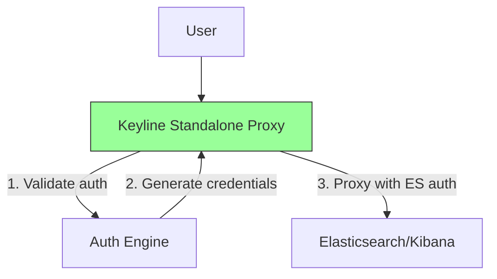
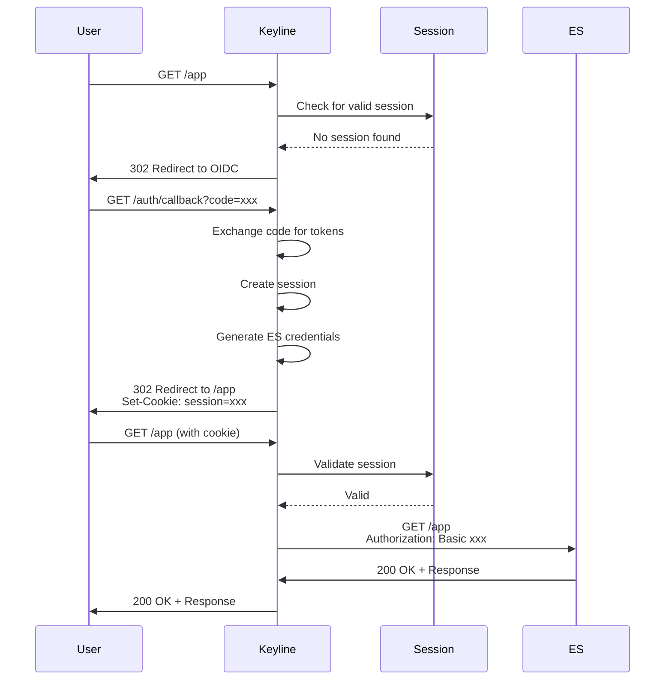

# Standalone Proxy Mode

Standalone mode runs Keyline as a full reverse proxy, handling both authentication and request proxying. This guide covers configuration, setup, and troubleshooting.

## Overview

In standalone mode, Keyline proxies all authenticated requests directly to upstream services (Elasticsearch, Kibana). Unlike ForwardAuth mode, Keyline handles the complete request flow.

## Architecture



## Configuration

### Basic Configuration

```yaml
server:
  port: 9000
  mode: standalone
  read_timeout: 30s
  write_timeout: 30s

upstream:
  url: http://kibana:5601
  timeout: 30s
  max_idle_conns: 100
  insecure_skip_verify: false
```

### Configuration Options

#### Server Section

| Option | Required | Default | Description |
|--------|----------|---------|-------------|
| `port` | No | 9000 | HTTP server port |
| `mode` | Yes | - | Must be `standalone` |
| `read_timeout` | No | 30s | Request read timeout |
| `write_timeout` | No | 30s | Response write timeout |

#### Upstream Section

| Option | Required | Default | Description |
|--------|----------|---------|-------------|
| `url` | Yes | - | Upstream service URL |
| `timeout` | No | 30s | Upstream request timeout |
| `max_idle_conns` | No | 100 | Max idle connections in pool |
| `insecure_skip_verify` | No | false | Skip TLS verification (dev only) |

## Use Cases

### Proxy to Kibana

```yaml
server:
  port: 9000
  mode: standalone

upstream:
  url: http://kibana:5601
  timeout: 30s
```

### Proxy to Elasticsearch

```yaml
server:
  port: 9000
  mode: standalone

upstream:
  url: https://elasticsearch:9200
  timeout: 30s
  insecure_skip_verify: true  # For self-signed certs
```

### Proxy to Custom Service

```yaml
server:
  port: 9000
  mode: standalone

upstream:
  url: http://my-app:8080
  timeout: 60s
```

## Docker Compose Example

```yaml
version: '3.8'

services:
  keyline:
    image: keyline:latest
    ports:
      - "9000:9000"
    volumes:
      - ./config.yaml:/etc/keyline/config.yaml
    environment:
      - SESSION_SECRET=${SESSION_SECRET}
      - CACHE_ENCRYPTION_KEY=${CACHE_ENCRYPTION_KEY}
      - ES_ADMIN_PASSWORD=${ES_ADMIN_PASSWORD}
    command: ["--config", "/etc/keyline/config.yaml"]
    depends_on:
      - kibana
    networks:
      - keyline-network

  kibana:
    image: docker.elastic.co/kibana/kibana:9.3.1
    environment:
      - ELASTICSEARCH_HOSTS=https://elasticsearch:9200
      - ELASTICSEARCH_USERNAME=kibana_system
      - ELASTICSEARCH_PASSWORD=kibana_password
    ports:
      - "5601:5601"
    networks:
      - keyline-network

  elasticsearch:
    image: docker.elastic.co/elasticsearch/elasticsearch:9.3.1
    environment:
      - discovery.type=single-node
      - xpack.security.enabled=true
    volumes:
      - es-data:/usr/share/elasticsearch/data
    networks:
      - keyline-network

volumes:
  es-data:

networks:
  keyline-network:
    driver: bridge
```

## Authentication Flow



## WebSocket Support

Keyline supports WebSocket upgrades in standalone mode:

```yaml
server:
  port: 9000
  mode: standalone

upstream:
  url: http://kibana:5601
  # WebSocket connections are automatically detected
  # and handled with bidirectional proxying
```

**Headers forwarded for WebSocket:**
- `Upgrade: websocket`
- `Connection: Upgrade`
- `Sec-WebSocket-Key`
- `Sec-WebSocket-Version`

## TLS Configuration

### Terminate TLS at Keyline

```yaml
server:
  port: 9000
  mode: standalone
  # TLS termination at Keyline

upstream:
  url: http://kibana:5601  # HTTP to upstream
```

### End-to-End TLS

```yaml
server:
  port: 9000
  mode: standalone

upstream:
  url: https://kibana:5601  # HTTPS to upstream
  insecure_skip_verify: false
  # Add CA certificate for self-signed certs
```

## Testing

### Test Health Endpoint

```bash
curl http://localhost:9000/healthz
```

### Test Authentication

```bash
# Without auth (should redirect)
curl -v http://localhost:9000/

# With Basic Auth
curl -v -u admin:password \
  http://localhost:9000/
```

### Test Proxying

```bash
# Test upstream connectivity
curl -v -u admin:password \
  http://localhost:9000/_cluster/health
```

## Troubleshooting

### 502 Bad Gateway

**Symptoms**: Keyline can't reach upstream

**Causes**:
- Upstream service down
- Wrong upstream URL
- Network issue

**Solution**:
```bash
# Check upstream health
curl http://kibana:5601/api/status

# Verify upstream URL
cat config.yaml | grep url:

# Check network connectivity
docker network inspect keyline-network
```

### 504 Gateway Timeout

**Symptoms**: Upstream response too slow

**Causes**:
- Upstream overloaded
- Timeout too short
- Large response

**Solution**:
```yaml
# Increase timeout
upstream:
  timeout: 120s  # 2 minutes
```

### WebSocket Connection Fails

**Symptoms**: WebSocket connections don't upgrade

**Causes**:
- Upstream doesn't support WebSocket
- Headers not forwarded

**Solution**:
1. Verify upstream supports WebSocket
2. Check Keyline logs for upgrade errors
3. Test WebSocket directly to upstream

## Next Steps

- **[ForwardAuth (Traefik)](./forwardauth-traefik.md)** - Traefik integration
- **[Auth Request (Nginx)](./auth-request-nginx.md)** - Nginx integration
- **[Docker Deployment](../deployment/docker.md)** - Docker setup guide
