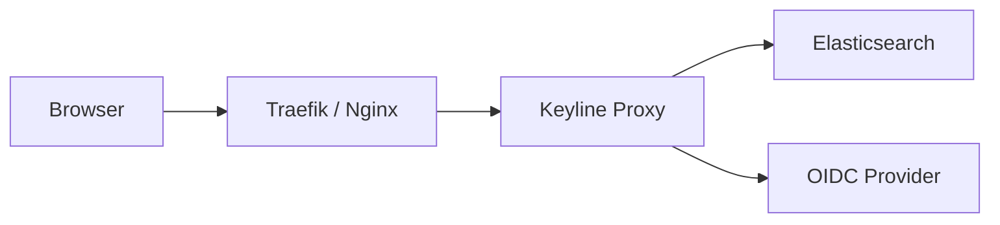

# About Keyline

**Modern Authentication Proxy for Elasticsearch**

Keyline is a unified authentication proxy service that provides dual authentication modes (OIDC and Basic Auth) simultaneously, supports multiple deployment modes (forwardAuth, auth_request, standalone proxy), and automatically injects Elasticsearch credentials into authenticated requests.

## Key Features

- **Dual Authentication**: Support both interactive (OIDC) and programmatic (Basic Auth) access simultaneously
- **Dynamic User Management**: Automatically create and manage Elasticsearch users for all authenticated users with role-based access control
- **Multiple Deployment Modes**: Works with Traefik (forwardAuth), Nginx (auth_request), or as standalone proxy
- **OIDC Support**: Full OpenID Connect implementation with PKCE, auto-discovery, and token validation
- **Session Management**: Redis or in-memory session storage with configurable TTL
- **Credential Mapping**: Automatic mapping of authenticated users to Elasticsearch credentials based on roles (legacy) or dynamic user creation (recommended)
- **Horizontal Scaling**: Redis-backed credential cache enables multi-instance deployments
- **Security First**: Cryptographic randomness, secure cookies, HTTPS enforcement, bcrypt password hashing, AES-256-GCM credential encryption
- **Production Ready**: Built-in observability, health checks, graceful shutdown, and comprehensive testing
- **Observability**: Prometheus metrics, OpenTelemetry tracing, structured logging with context
- **WebSocket Support**: Full WebSocket proxying support for real-time applications

## Architecture

Keyline acts as an authentication gateway between your users and Elasticsearch:

**ForwardAuth Mode**: Keyline validates authentication and returns headers to the reverse proxy.

**Standalone Mode**: Keyline proxies all requests directly to Elasticsearch.

## Use Cases

| Use Case | Description |
|----------|-------------|
| **Secure Elasticsearch Access** | Add authentication to Elasticsearch without modifying your application |
| **Dynamic User Management** | Automatically create ES users for all authenticated users with proper role-based access control |
| **Audit and Accountability** | ES audit logs show actual usernames instead of shared accounts |
| **Multi-Tenant Deployments** | Map different users/roles to different Elasticsearch credentials or roles |
| **Hybrid Authentication** | Support both interactive users (OIDC) and API clients (Basic Auth) |
| **Horizontal Scaling** | Deploy multiple Keyline instances with shared Redis cache for high availability |
| **Compliance** | Centralized authentication and audit logging for Elasticsearch access |
| **Zero-Trust Architecture** | Enforce authentication at the gateway level |

## Quick Links

- [**Architecture Overview**](./architecture.md) - Learn how Keyline works
- [**Quick Start**](./quick-start.md) - Get running in 5 minutes
- [**Configuration**](../configuration.md) - Understand configuration options
- [**Migration from Elastauth**](./migration-from-elastauth.md) - Moving from elastauth?

## Deployment Options

Keyline supports multiple deployment scenarios:

- **Docker**: Pre-built images available on Docker Hub
- **Kubernetes**: Helm charts and manifests for K8s deployments
- **Binary**: Standalone binary for bare-metal installations
- **Source**: Build from source for custom configurations

## Community and Support

- **GitHub**: [wasilak/keyline](https://github.com/wasilak/keyline)
- **Issues**: [Report bugs or request features](https://github.com/wasilak/keyline/issues)
- **Discussions**: [Join the community](https://github.com/wasilak/keyline/discussions)

## License

MIT License - see [LICENSE](https://github.com/wasilak/keyline/blob/main/LICENSE) for details.
