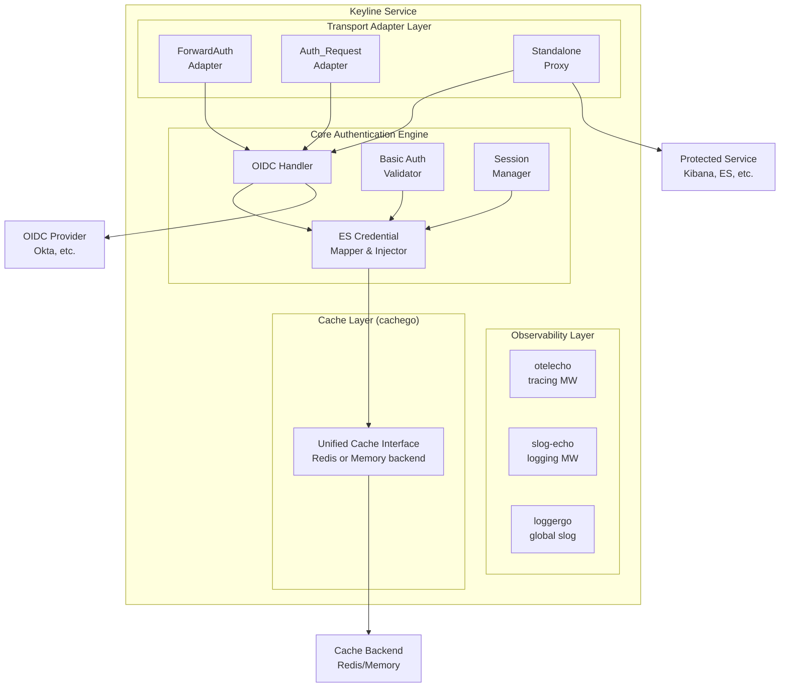
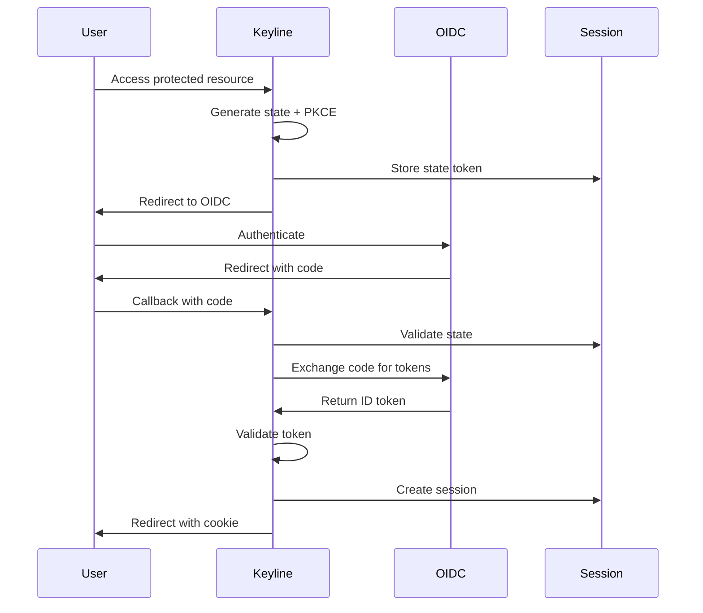
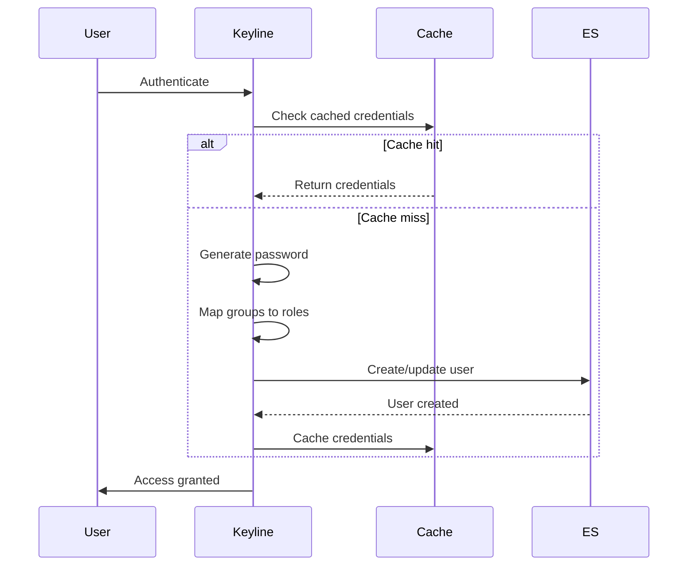
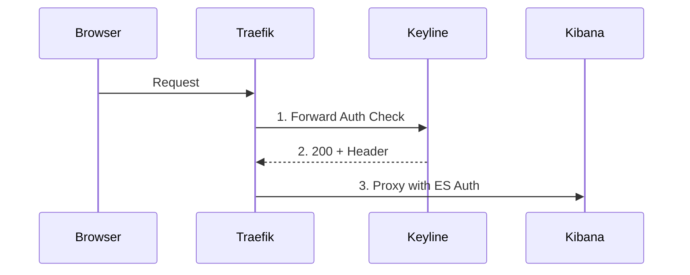
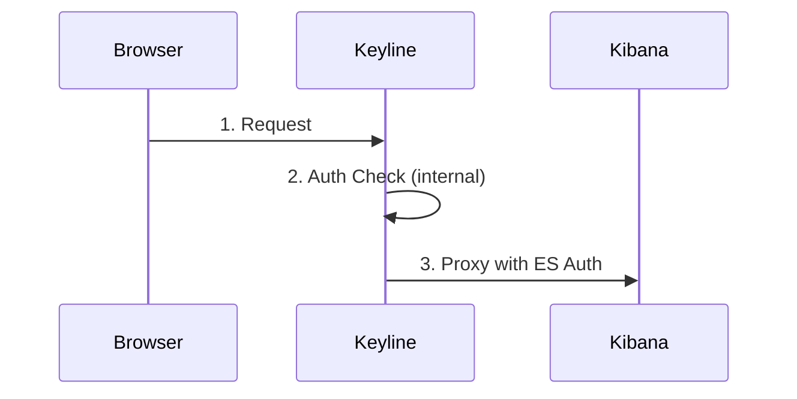

# Architecture

Keyline is a unified authentication proxy service that replaces the existing Authelia + elastauth stack. It provides dual authentication modes (OIDC and Basic Auth) simultaneously, supports three deployment modes (forwardAuth, auth_request, standalone proxy), and automatically injects Elasticsearch credentials into authenticated requests.

## Design Goals

- **Unified Service**: Single binary replacing two-service architecture
- **Dual Authentication**: Support both interactive (OIDC) and programmatic (Basic Auth) access simultaneously
- **Deployment Flexibility**: Work with Traefik, Nginx, or as standalone proxy
- **Security First**: Implement PKCE, secure session management, and cryptographic best practices
- **Production Ready**: Built-in observability, health checks, and graceful shutdown
- **Full Observability**: OpenTelemetry tracing and structured logging from day one
- **Unified Caching**: Single cache interface for sessions, state tokens, and OIDC data

## High-Level Architecture

## Component Responsibilities

### Observability Layer

| Component | Purpose |
|-----------|---------|
| **otelecho** | Automatic OpenTelemetry tracing for all HTTP requests |
| **slog-echo** | Automatic structured logging for all HTTP requests with trace correlation |
| **loggergo** | Global slog configuration (JSON/text format, log levels) |

### Transport Adapter Layer

| Component | Purpose |
|-----------|---------|
| **ForwardAuth Adapter** | Handles Traefik X-Forwarded-* headers, returns auth decisions |
| **Auth_Request Adapter** | Handles Nginx X-Original-* headers, returns auth decisions |
| **Standalone Proxy** | Proxies authenticated requests to upstream, handles WebSocket upgrades |

### Core Authentication Engine

| Component | Purpose |
|-----------|---------|
| **OIDC Handler** | Manages authorization flow, token exchange, ID token validation |
| **Basic Auth Validator** | Validates local user credentials using bcrypt |
| **Session Manager** | Creates, validates, extends, and deletes user sessions |
| **ES Credential Mapper** | Maps authenticated users to Elasticsearch credentials |

### Cache Layer (cachego)

| Feature | Description |
|---------|-------------|
| **Unified Interface** | Single cache interface for all storage needs |
| **Sessions** | Stores user sessions with TTL (key: `session:{id}`) |
| **State Tokens** | Stores OIDC CSRF tokens with 5-minute TTL (key: `state:{id}`) |
| **OIDC Discovery** | Caches discovery documents (key: `oidc:discovery:{issuer}`) |
| **JWKS** | Caches JSON Web Key Sets (key: `oidc:jwks:{issuer}`) |
| **Backend Agnostic** | Supports Redis or in-memory backends via configuration |

## Technology Stack

| Layer | Technology |
|-------|------------|
| **Language** | Go 1.22+ |
| **Web Framework** | Echo v4 |
| **Configuration** | Viper |
| **Cache Layer** | cachego (unified interface for Redis/in-memory) |
| **Logging** | loggergo (global slog setup) |
| **Echo Logging** | slog-echo (request logging middleware) |
| **Tracing** | otelgo (OpenTelemetry setup) |
| **Echo Tracing** | otelecho (request tracing middleware) |
| **OIDC** | coreos/go-oidc v3 + golang.org/x/oauth2 |
| **Proxy** | net/http/httputil.ReverseProxy |
| **Crypto** | crypto/rand, bcrypt |

## Authentication Flow

### OIDC Authentication Flow

### Dynamic User Management Flow

## Deployment Modes

### ForwardAuth Mode (Traefik/Nginx)

### Standalone Mode

## Next Steps

- [**Quick Start**](./quick-start.md) - Get Keyline running in 5 minutes
- [**Configuration**](../configuration.md) - Learn about configuration options
- [**Deployment Modes**](../deployment-modes/forwardauth-traefik.md) - Choose your deployment mode
