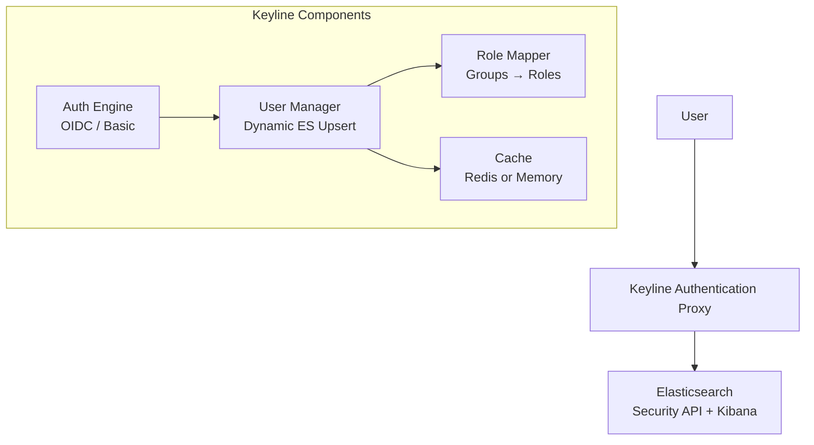

# Migration from Elastauth

Keyline is the next-generation authentication proxy for Elasticsearch, designed as the successor to [elastauth](https://github.com/wasilak/elastauth). It inherits elastauth's core innovation—**transparent Elasticsearch user upsert**—while significantly expanding capabilities, security, and deployment flexibility.

## What Stays the Same

✅ **Core behavior**: Transparent ES user upsert  
✅ **Cache strategy**: Redis with TTL-based expiry  
✅ **Security model**: Short-lived, randomly generated passwords  
✅ **Audit benefits**: Individual usernames in ES logs  

## What Changes

🔄 **Configuration**: Single config file instead of Authelia + elastauth  
🔄 **Deployment**: One container instead of two  
🔄 **Authentication**: Add OIDC/local users alongside LDAP  
🔄 **Role mapping**: More flexible pattern matching  

## Architecture Comparison

### Elastauth Architecture

Elastauth pioneered the two-stage forwardAuth approach for Traefik:

```
User → Traefik → Authelia (LDAP) → Elastauth (ES User Mgmt) → Elasticsearch
```

**Key Characteristics:**
- Two-stage authentication: Authelia (LDAP) + elastauth (user mgmt)
- Traefik-specific: Uses forwardAuth middleware
- LDAP-only: Requires Authelia for LDAP/AD authentication
- External dependencies: Authelia + Redis + Elasticsearch

### Keyline Architecture

Keyline consolidates everything into a single, flexible proxy:



**Key Characteristics:**
- All-in-one: Single service handles all authentication
- Proxy-agnostic: Works with Traefik, Nginx, HAProxy, or standalone
- Multi-method: OIDC, Basic Auth (local users)
- Flexible caching: Redis (distributed) or in-memory (single-node)

## Feature Comparison

| Feature | Elastauth | Keyline | Status |
|---------|-----------|---------|--------|
| **Authentication Methods** |
| LDAP/Active Directory | ✅ (via Authelia) | ✅ (native) | ✅ Enhanced |
| OIDC (Google, Azure AD, Okta) | ❌ | ✅ | ✅ New |
| Local Users (Basic Auth) | ❌ | ✅ | ✅ New |
| **Architecture** |
| Deployment Model | Two-stage | Single-stage | ✅ Simplified |
| Reverse Proxy Support | Traefik only | Any proxy | ✅ Flexible |
| **User Management** |
| Dynamic ES User Creation | ✅ (LDAP only) | ✅ (ALL methods) | ✅ Enhanced |
| Credential Caching | Redis | Redis or memory | ✅ Enhanced |
| Password Encryption | ❌ | ✅ (AES-256-GCM) | ✅ New |
| **Role Mapping** |
| Group-to-Role Mapping | Basic | Advanced | ✅ Enhanced |
| Multiple Groups → Roles | ❌ | ✅ | ✅ New |
| Default Roles | ❌ | ✅ | ✅ New |
| **Observability** |
| Logging | Basic | Structured | ✅ Enhanced |
| Distributed Tracing | ❌ | OpenTelemetry | ✅ New |
| Metrics | ❌ | Prometheus | ✅ New |

## Configuration Mapping

| Elastauth Concept | Keyline Equivalent |
|-------------------|-------------------|
| `config.yml` (elastauth) | `config.yaml` (Keyline) |
| Authelia LDAP config | `local_users` or external LDAP |
| `role_mapping` | `role_mappings` (enhanced syntax) |
| Redis cache config | `cache` section (Redis or memory) |
| Traefik forwardAuth | Works with any forward auth |

## Migration Checklist

### Phase 1: Preparation

- [ ] Review current elastauth configuration
- [ ] Document existing role mappings
- [ ] Identify all users/groups currently configured
- [ ] Backup Elasticsearch user data
- [ ] Test Keyline in isolated environment

### Phase 2: Configuration Conversion

- [ ] Convert elastauth config to Keyline format
- [ ] Map LDAP groups to Keyline `role_mappings`
- [ ] Configure session management
- [ ] Set up Redis cache (if using)
- [ ] Generate encryption keys

### Phase 3: Testing

- [ ] Test with subset of users
- [ ] Verify role mappings work correctly
- [ ] Test cache hit/miss behavior
- [ ] Verify ES audit logs show usernames
- [ ] Test failover scenarios

### Phase 4: Deployment

- [ ] Deploy Keyline alongside elastauth
- [ ] Update Traefik/Nginx configuration
- [ ] Migrate users in batches
- [ ] Monitor for issues
- [ ] Decommission elastauth

## Example Migration

### Before: Elastauth Configuration

```yaml
# elastauth config.yml
redis:
  addr: redis:6379

role_mapping:
  - group: "cn=admins,dc=example,dc=com"
    es_user: admin
  - group: "cn=developers,dc=example,dc=com"
    es_user: developer

default_es_user: readonly

elasticsearch:
  users:
    - username: admin
      password: ${ES_ADMIN_PASSWORD}
    - username: developer
      password: ${ES_DEV_PASSWORD}
```

### After: Keyline Configuration

```yaml
# Keyline config.yaml
server:
  port: 9000
  mode: forward_auth

local_users:
  enabled: true
  users:
    - username: admin
      password_bcrypt: ${ADMIN_PASSWORD_BCRYPT}
      groups:
        - admin
      email: admin@example.com
      full_name: Admin User

session:
  ttl: 24h
  cookie_name: keyline_session
  cookie_domain: .example.com
  session_secret: ${SESSION_SECRET}

cache:
  backend: redis
  redis_url: redis://redis:6379
  credential_ttl: 1h
  encryption_key: ${CACHE_ENCRYPTION_KEY}

role_mappings:
  - claim: groups
    pattern: "admin"
    es_roles:
      - superuser
  - claim: groups
    pattern: "developers"
    es_roles:
      - developer
      - kibana_user

default_es_roles:
  - viewer

elasticsearch:
  admin_user: ${ES_ADMIN_USER}
  admin_password: ${ES_ADMIN_PASSWORD}
  url: https://elasticsearch:9200
  timeout: 30s

user_management:
  enabled: true
  password_length: 32
  credential_ttl: 1h
```

## New Capabilities in Keyline

### 1. OIDC Authentication

Add Google, Azure AD, Okta, or any OIDC provider:

```yaml
oidc:
  enabled: true
  issuer_url: https://accounts.google.com
  client_id: ${OIDC_CLIENT_ID}
  client_secret: ${OIDC_CLIENT_SECRET}
  redirect_url: https://auth.example.com/auth/callback
```

### 2. Encrypted Credential Cache

Passwords are encrypted with AES-256-GCM before caching:

```yaml
cache:
  encryption_key: ${CACHE_ENCRYPTION_KEY}  # 32 bytes
```

### 3. Flexible Role Mappings

Multiple groups map to multiple ES roles:

```yaml
role_mappings:
  - claim: groups
    pattern: "*-developers"  # Matches backend-developers, frontend-developers
    es_roles:
      - developer
      - kibana_user
```

### 4. Default Roles

Fallback roles when no mappings match:

```yaml
default_es_roles:
  - viewer
  - kibana_user
```

### 5. Enhanced Observability

```yaml
observability:
  log_level: info
  log_format: json
  otel_enabled: true
  otel_endpoint: http://otel-collector:4318
  metrics_enabled: true
```

## Troubleshooting Migration Issues

### Issue: "encryption key must be 32 bytes"

**Solution**: Generate key correctly:

```bash
openssl rand -base64 32
```

### Issue: "admin credentials invalid"

**Solution**: Verify ES admin user has `manage_security` privilege:

```bash
curl -u elastic:password https://localhost:9200/_security/user/keyline_admin
```

### Issue: "no role mappings matched"

**Solution**: Add `default_es_roles` or ensure user groups match patterns.

### Issue: Cache hit rate < 95%

**Solution**: Increase `credential_ttl` or check Redis connectivity.

## Post-Migration Verification

After migration, verify:

- [ ] Users authenticate successfully
- [ ] ES users are created dynamically
- [ ] Groups map to ES roles correctly
- [ ] Credentials are cached and reused
- [ ] ES audit logs show actual usernames
- [ ] Metrics are exposed (Prometheus endpoint)
- [ ] Traces are visible (if OpenTelemetry enabled)

## Rollback Plan

If issues occur:

1. Keep elastauth running in parallel
2. Revert Traefik/Nginx configuration
3. Investigate logs for root cause
4. Fix Keyline configuration
5. Retry migration

## Additional Resources

- **[Configuration](../configuration.md)** - Complete configuration options
- **[User Management](../user-management/dynamic-user-management.md)** - Dynamic ES user management
- **[Troubleshooting](../troubleshooting.md)** - Common issues and solutions
