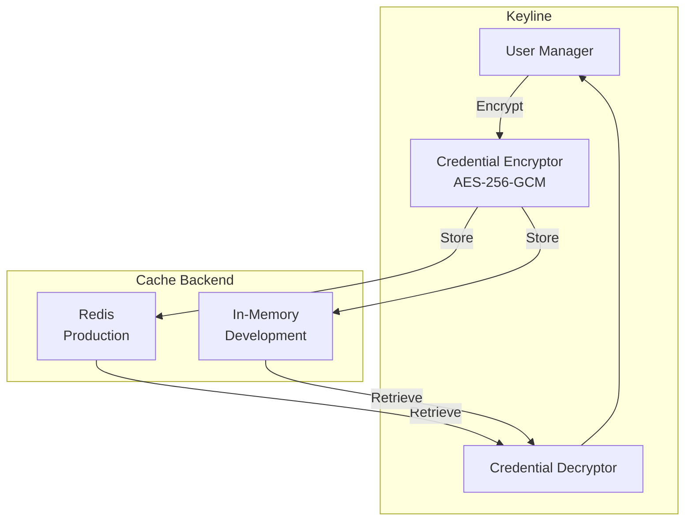
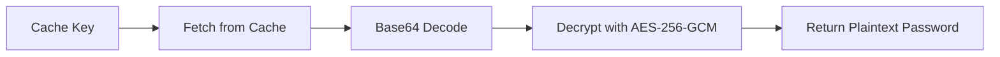
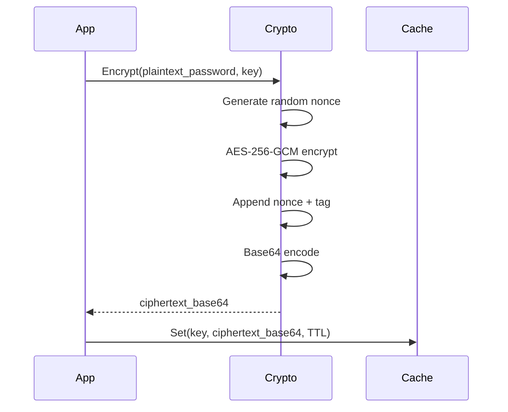

# Credential Caching

Credential caching stores generated Elasticsearch passwords securely with configurable TTL, enabling high-performance authentication without repeated ES API calls.

## Overview

When Keyline creates a dynamic ES user, the generated password is cached for subsequent requests. This avoids recreating the user on every request while maintaining security through automatic password rotation.

## Architecture



## Configuration

### Basic Configuration

```yaml
cache:
  backend: redis  # or 'memory'
  redis_url: redis://localhost:6379
  redis_password: ${REDIS_PASSWORD}
  redis_db: 0
  credential_ttl: 1h
  encryption_key: ${CACHE_ENCRYPTION_KEY}
```

### Configuration Options

| Option | Required | Default | Description |
|--------|----------|---------|-------------|
| `backend` | Yes | - | Cache backend: `redis` or `memory` |
| `redis_url` | Yes (if redis) | - | Redis connection URL |
| `redis_password` | No | - | Redis authentication password |
| `redis_db` | No | 0 | Redis database number (0-15) |
| `credential_ttl` | No | 1h | Password cache TTL (5m to 24h) |
| `encryption_key` | Yes | - | 32-byte key for AES-256-GCM |

## Cache Key Format

```
keyline:user:{username}:password
```

**Examples:**
- `keyline:user:alice@example.com:password`
- `keyline:user:ci-pipeline:password`
- `keyline:user:admin@admin.example.com:password`

## Cache Operations

### Store (Set)


**Process:**
1. Generate random password (32 chars)
2. Encrypt with AES-256-GCM
3. Base64 encode ciphertext
4. Store in cache with TTL

### Retrieve (Get)



**Process:**
1. Fetch base64-encoded ciphertext
2. Base64 decode
3. Decrypt with AES-256-GCM
4. Return plaintext password

### Delete (Invalidate)


**Triggers:**
- User update (role changes)
- Manual invalidation
- TTL expiration (automatic)

## Cache Backends

### Redis Backend

**Use Case**: Production, multi-node, high availability

```yaml
cache:
  backend: redis
  redis_url: redis://redis-cluster:6379
  redis_password: ${REDIS_PASSWORD}
  redis_db: 0
  credential_ttl: 1h
  encryption_key: ${CACHE_ENCRYPTION_KEY}
```

**Pros:**
- Persistent across Keyline restarts
- Shared across multiple Keyline instances
- Automatic TTL management
- High availability with Redis Cluster

**Cons:**
- Requires Redis infrastructure
- Network latency
- Additional failure point

**Redis Configuration Recommendations:**

| Setting | Recommended | Purpose |
|---------|-------------|---------|
| **Max Memory** | 1GB+ | Cache growth headroom |
| **Eviction Policy** | `allkeys-lru` | Automatic cleanup |
| **Persistence** | RDB snapshots | Crash recovery |
| **TLS** | Enabled | Encryption in transit |

### Memory Backend

**Use Case**: Development, testing, single-node

```yaml
cache:
  backend: memory
  credential_ttl: 1h
  encryption_key: ${CACHE_ENCRYPTION_KEY}
```

**Pros:**
- Simple configuration
- No external dependencies
- Fastest access (no network)

**Cons:**
- Lost on Keyline restart
- No horizontal scaling
- Memory grows with active users

## Encryption

### Algorithm: AES-256-GCM

| Property | Value |
|----------|-------|
| **Algorithm** | AES-256-GCM |
| **Key Size** | 256 bits (32 bytes) |
| **Nonce Size** | 96 bits (12 bytes) |
| **Tag Size** | 128 bits (16 bytes) |
| **Mode** | Authenticated Encryption |

### Key Management

**Generation:**
```bash
openssl rand -base64 32
```

**Storage:**
- ✅ Environment variable: `CACHE_ENCRYPTION_KEY`
- ✅ Secrets manager: Vault, AWS Secrets Manager
- ❌ Config file (even with gitignore)

**Rotation:**
- Rotate periodically (quarterly recommended)
- Invalidates all cached credentials
- Users re-authenticate naturally via TTL

### Encryption Flow



## TTL Management

### Recommended TTL Values

| Use Case | TTL | Rationale |
|----------|-----|-----------|
| **Development** | 1h | Convenient for testing |
| **Production (Internal)** | 1h | Balance security/performance |
| **Production (External)** | 30m | Higher security |
| **High Security** | 5-15m | Minimal exposure window |
| **Service Accounts** | 1h | Stable access |

### TTL Range

| Minimum | Maximum | Default |
|---------|---------|---------|
| 5 minutes | 24 hours | 1 hour |

### TTL Expiration

When TTL expires:
1. Cache entry is automatically deleted (Redis) or cleaned up (Memory)
2. Next request triggers cache miss
3. New password is generated
4. ES user is updated
5. New credentials are cached

## Performance

### Performance Targets

| Metric | Target |
|--------|--------|
| **Cache Hit Latency** | < 10ms (p95) |
| **Cache Miss Latency** | < 500ms (p95) |
| **Hit Rate** | > 95% for active users |

### Optimization Tips

1. **Use Redis for production**: Better scalability
2. **Tune TTL**: Balance security vs. cache hit rate
3. **Monitor hit rate**: Alert if < 90%
4. **Size cache appropriately**: Plan for active user count

## Monitoring

### Metrics

```prometheus
# Cache operations
keyline_cred_cache_hits_total
keyline_cred_cache_misses_total

# Cache hit rate (calculated)
rate(keyline_cred_cache_hits_total[5m]) / 
(rate(keyline_cred_cache_hits_total[5m]) + rate(keyline_cred_cache_misses_total[5m]))

# Encryption operations
keyline_cred_encrypt_total{status="success|failure"}
keyline_cred_decrypt_total{status="success|failure"}
```

### Logging

```json
{
  "level": "debug",
  "message": "Credential cache hit",
  "username": "user@example.com",
  "cache_backend": "redis",
  "ttl_remaining": "45m"
}
```

## Troubleshooting

### Cache Connection Failed (Redis)

**Symptoms**: All requests are cache misses, Redis errors in logs

**Causes**:
- Redis unreachable
- Authentication failed
- Network issue

**Solution**:
1. Check Redis connectivity: `redis-cli ping`
2. Verify `redis_url` format
3. Check `redis_password`
4. Review network policies

### Encryption Key Invalid

**Symptoms**: `encryption key must be 32 bytes`

**Causes**:
- Key not 32 bytes
- Base64 decoding failed

**Solution**:
```bash
# Generate correct key
openssl rand -base64 32

# Verify length
echo -n "your-key" | wc -c  # Should be 32
```

### High Cache Miss Rate

**Symptoms**: Hit rate < 90%

**Causes**:
- TTL too short
- Many unique users
- Cache eviction

**Solution**:
1. Increase `credential_ttl`
2. Check Redis memory usage
3. Review eviction policy

## Security Best Practices

1. **Use Redis TLS**: Encrypt in transit
   ```yaml
   redis_url: rediss://redis:6379  # Note: rediss://
   ```

2. **Rotate encryption key**: Quarterly rotation
   ```bash
   # Generate new key
   openssl rand -base64 32
   # Update environment variable
   # Restart Keyline instances
   ```

3. **Restrict Redis access**: Network isolation
   ```bash
   # Redis bind to private network only
   bind 10.0.0.1
   ```

4. **Monitor cache access**: Alert on anomalies
   ```prometheus
   # Alert on high miss rate
   - alert: HighCacheMissRate
     expr: cache_miss_rate > 0.1
     for: 5m
   ```

## Next Steps

- **[Dynamic User Management](./dynamic-user-management.md)** - User management overview
- **[Role Mappings](./role-mappings.md)** - Map groups to ES roles
- **[Troubleshooting](../troubleshooting.md)** - Common issues
