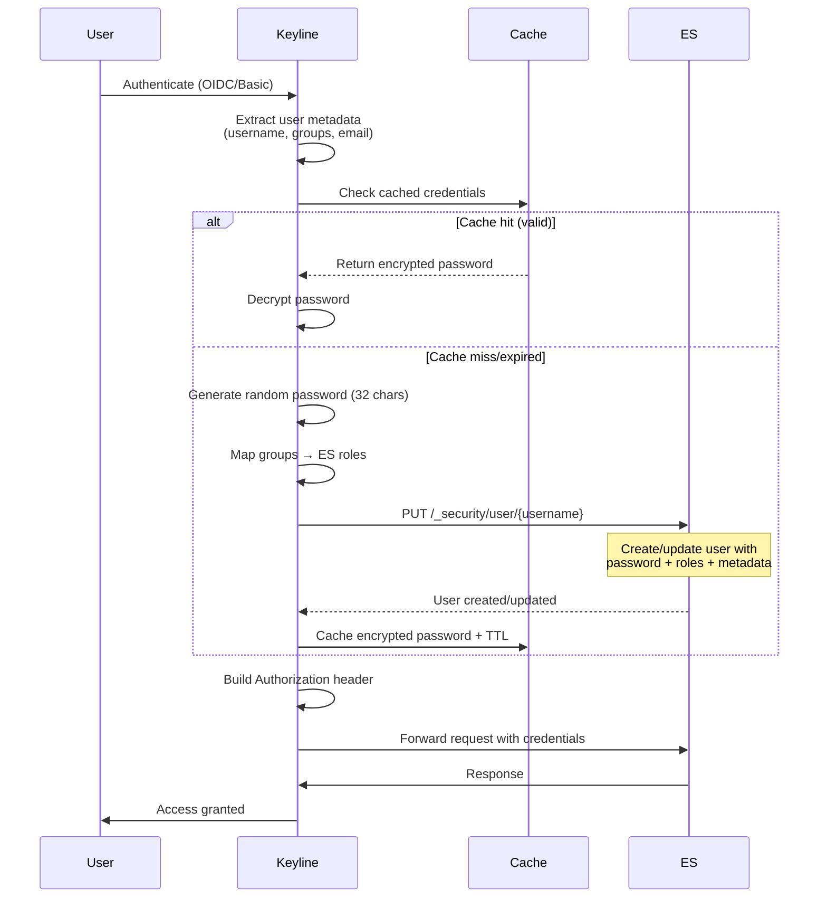
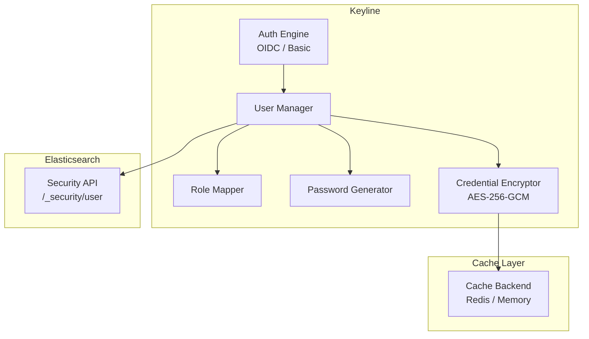
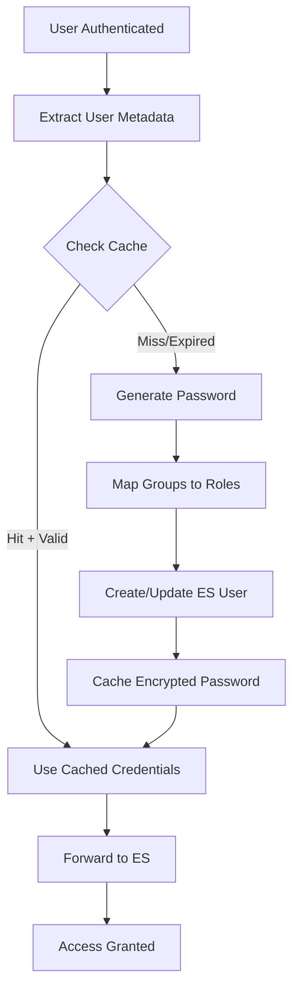
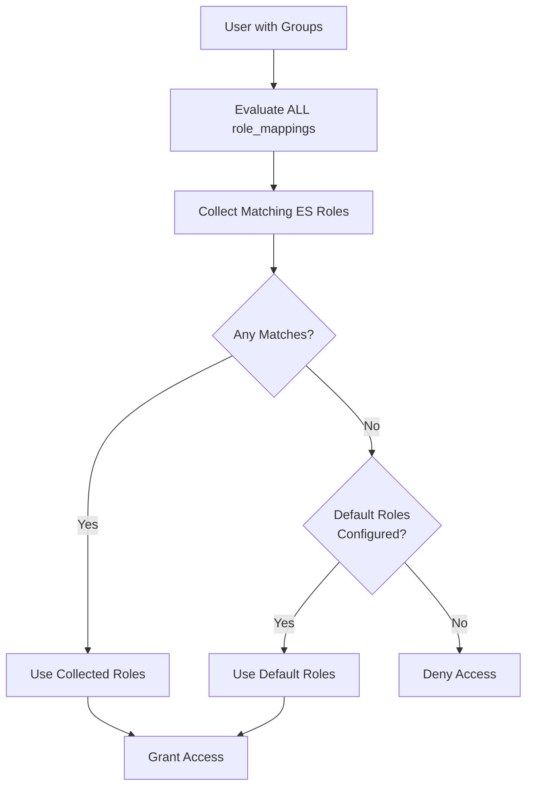

# Dynamic User Management

Dynamic Elasticsearch User Management automatically creates and manages ES users for ALL authenticated users (OIDC, Basic Auth, etc.). This provides accountability, auditing, and proper role-based access control without requiring pre-configured ES users.

## Overview

Keyline's dynamic user management is the core innovation inherited from elastauth, significantly enhanced with additional security and flexibility.

### Key Benefits

| Benefit | Description |
|---------|-------------|
| **Accountability** | Each user has their own ES account |
| **Auditing** | ES audit logs show actual usernames |
| **Security** | Random, short-lived passwords |
| **Role-based Access** | User groups map to ES roles |
| **Scalability** | Redis cache enables multi-instance deployments |

### How It Works



## Architecture

### Component Overview



### Components

| Component | Purpose |
|-----------|---------|
| **User Manager** | Orchestrates user creation, role mapping, credential caching |
| **Role Mapper** | Maps user groups to Elasticsearch roles |
| **Password Generator** | Generates cryptographically secure random passwords |
| **Credential Encryptor** | Encrypts passwords before caching (AES-256-GCM) |
| **Cache Backend** | Stores encrypted credentials with TTL |

## Configuration

### Enable Dynamic User Management

```yaml
user_management:
  enabled: true
  password_length: 32
  credential_ttl: 1h
```

### Required Configuration

| Option | Required | Default | Description |
|--------|----------|---------|-------------|
| `enabled` | Yes | false | Enable dynamic user management |
| `password_length` | No | 32 | Generated password length (min 32) |
| `credential_ttl` | No | 1h | Password cache TTL (5m to 24h) |

### Elasticsearch Admin Credentials

```yaml
elasticsearch:
  admin_user: ${ES_ADMIN_USER}
  admin_password: ${ES_ADMIN_PASSWORD}
  url: https://elasticsearch:9200
  timeout: 30s
```

**Requirements for Admin User:**
- Must have `manage_security` privilege
- Used exclusively for Security API calls
- Validated on Keyline startup

### Cache Configuration

```yaml
cache:
  backend: redis  # or 'memory'
  redis_url: redis://localhost:6379
  credential_ttl: 1h
  encryption_key: ${CACHE_ENCRYPTION_KEY}  # 32 bytes required
```

**Encryption Key Requirements:**
- Must be exactly 32 bytes (256 bits) for AES-256-GCM
- Generate with: `openssl rand -base64 32`
- Store in environment variable (not in config file)
- All Keyline instances must use same key (for Redis)

## User Upsert Flow

### Step-by-Step Process



### User Metadata Extraction

| Field | Source | Required |
|-------|--------|----------|
| **Username** | OIDC claim or local user config | Yes |
| **Groups** | OIDC `groups` claim or local user `groups` | No |
| **Email** | OIDC `email` claim or local user `email` | No |
| **Full Name** | OIDC `name` claim or local user `full_name` | No |

### ES User Creation

Keyline creates ES users with the following structure:

```json
PUT /_security/user/{username}
{
  "password": "random-32-char-password",
  "roles": ["developer", "kibana_user"],
  "full_name": "User Name",
  "email": "user@example.com",
  "metadata": {
    "source": "oidc:google",
    "last_auth": "2024-01-01T00:00:00Z",
    "groups": ["developers", "users"]
  }
}
```

## Role Mapping

### Configuration

```yaml
role_mappings:
  - claim: groups
    pattern: "admin"
    es_roles:
      - superuser

  - claim: groups
    pattern: "*-developers"
    es_roles:
      - developer
      - kibana_user

default_es_roles:
  - viewer
  - kibana_user
```

### Evaluation Logic



### Examples

| User Groups | Mappings Matched | ES Roles Assigned |
|-------------|------------------|-------------------|
| `["admin"]` | `admin` → `superuser` | `["superuser"]` |
| `["backend-developers", "users"]` | `*-developers` → `developer, kibana_user` | `["developer", "kibana_user"]` |
| `["unknown-group"]` | No matches, has defaults | `["viewer", "kibana_user"]` |
| `[]` (no groups) | No matches, has defaults | `["viewer", "kibana_user"]` |
| `[]` (no groups, no defaults) | No matches, no defaults | **Access Denied** |

## Credential Caching

### Cache Key Format

```
keyline:user:{username}:password
```

### Cache Operations

| Operation | Description |
|-----------|-------------|
| **Set** | Encrypt password, store with TTL |
| **Get** | Retrieve, decrypt, return |
| **Delete** | Remove from cache (on user update) |

### Cache Backends

| Backend | Use Case | Pros | Cons |
|---------|----------|------|------|
| **Redis** | Production, multi-node | Persistent, scalable, shared | Requires Redis infrastructure |
| **Memory** | Development, single-node | Simple, no dependencies | Lost on restart, no scaling |

### Performance Targets

| Metric | Target |
|--------|--------|
| User upsert (cache miss) | < 500ms (p95) |
| User upsert (cache hit) | < 10ms (p95) |
| Cache hit rate | > 95% for active users |

## Security Features

### Password Security

| Feature | Implementation |
|---------|----------------|
| **Generation** | `crypto/rand` (cryptographically secure) |
| **Length** | Minimum 32 characters |
| **Complexity** | Uppercase, lowercase, digits, special characters |
| **Logging** | Never logged or exposed |

### Encryption

| Feature | Implementation |
|---------|----------------|
| **Algorithm** | AES-256-GCM (authenticated encryption) |
| **Key Size** | 256 bits (32 bytes) |
| **Nonce** | Random for each encryption |
| **Encoding** | Base64 for cache storage |

### Admin Credentials

| Feature | Implementation |
|---------|----------------|
| **Storage** | Environment variables only |
| **Usage** | Security API calls only |
| **Validation** | Checked on startup |
| **Logging** | Never logged or exposed |

## Monitoring

### Metrics

```prometheus
# User upserts
keyline_user_upserts_total{status="success|failure"}

# User upsert duration
keyline_user_upsert_duration_seconds{cache_status="hit|miss"}

# Cache operations
keyline_cred_cache_hits_total
keyline_cred_cache_misses_total

# Role mapping
keyline_role_mapping_matches_total{pattern="admin"}

# ES API calls
keyline_es_api_calls_total{operation="create_user", status="200"}
```

### Logging

```json
{
  "level": "info",
  "message": "ES user created",
  "username": "user@example.com",
  "roles": ["developer", "kibana_user"],
  "source": "oidc:google",
  "duration": "125ms",
  "cache_status": "miss"
}
```

## Next Steps

- **[Role Mappings](./role-mappings.md)** - Detailed role mapping configuration
- **[Configuration Guide](../configuration.md)** - Complete configuration reference
- **[Troubleshooting](../troubleshooting.md)** - Common issues and solutions
