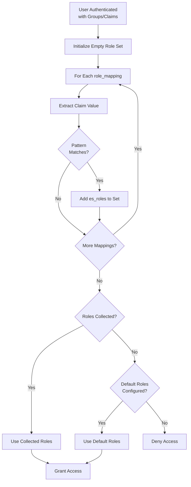

# Role Mappings

Role mappings configure how user groups and claims are mapped to Elasticsearch roles. This is a core component of dynamic user management.

## Overview

Role mappings provide flexible, configurable mapping from authentication metadata (groups, email, etc.) to Elasticsearch roles. Multiple groups can map to multiple ES roles, and Elasticsearch handles users with multiple roles natively.

## Configuration Structure

```yaml
role_mappings:
  - claim: groups
    pattern: "admin"
    es_roles:
      - superuser

  - claim: groups
    pattern: "*-developers"
    es_roles:
      - developer
      - kibana_user

default_es_roles:
  - viewer
  - kibana_user
```

## Configuration Options

### Role Mapping Entry

| Option | Required | Description |
|--------|----------|-------------|
| `claim` | Yes | Claim name to evaluate (`groups` or `email`) |
| `pattern` | Yes | Pattern to match (supports `*` wildcard) |
| `es_roles` | Yes | Array of ES role names to assign |

### Default Roles

| Option | Required | Description |
|--------|----------|-------------|
| `default_es_roles` | No | Fallback roles if no mappings match |

## Evaluation Logic



### Key Rules

1. **Evaluate ALL mappings**: Every role_mapping is evaluated in order
2. **Collect ALL matches**: Multiple matches accumulate roles
3. **Deduplicate**: ES roles are deduplicated automatically
4. **Fallback to defaults**: If no matches and defaults configured, use defaults
5. **Deny if no match**: If no matches and no defaults, access is denied

## Pattern Matching

### Supported Patterns

| Pattern Type | Example | Matches |
|--------------|---------|---------|
| **Exact Match** | `admin` | `admin` |
| **Wildcard Prefix** | `*-developers` | `backend-developers`, `frontend-developers` |
| **Wildcard Suffix** | `admin@*` | `admin@example.com`, `admin@test.com` |
| **Wildcard Middle** | `*@*.com` | `user@example.com`, `admin@test.com` |

### Pattern Examples

#### Group-Based Mappings

```yaml
role_mappings:
  # Exact match
  - claim: groups
    pattern: "admin"
    es_roles:
      - superuser

  # Wildcard prefix
  - claim: groups
    pattern: "*-developers"
    es_roles:
      - developer
      - kibana_user

  # Wildcard suffix
  - claim: groups
    pattern: "admin@*"
    es_roles:
      - superuser
```

#### Email-Based Mappings

```yaml
role_mappings:
  # Domain-based
  - claim: email
    pattern: "*@admin.example.com"
    es_roles:
      - superuser

  # Department-based
  - claim: email
    pattern: "*@engineering.example.com"
    es_roles:
      - developer
      - kibana_user

  # Specific user
  - claim: email
    pattern: "john.doe@example.com"
    es_roles:
      - superuser
```

## Configuration Examples

### Example 1: Simple Group Mapping

```yaml
local_users:
  users:
    - username: alice
      groups:
        - admin
    - username: bob
      groups:
        - developers

role_mappings:
  - claim: groups
    pattern: "admin"
    es_roles:
      - superuser

  - claim: groups
    pattern: "developers"
    es_roles:
      - developer
      - kibana_user

default_es_roles:
  - viewer
```

**Results:**
- Alice (groups: `["admin"]`) → ES roles: `["superuser"]`
- Bob (groups: `["developers"]`) → ES roles: `["developer", "kibana_user"]`
- User with no groups → ES roles: `["viewer"]`

### Example 2: Multiple Group Matches

```yaml
local_users:
  users:
    - username: charlie
      groups:
        - backend-developers
        - users
        - oncall

role_mappings:
  - claim: groups
    pattern: "*-developers"
    es_roles:
      - developer
      - kibana_user

  - claim: groups
    pattern: "users"
    es_roles:
      - user

  - claim: groups
    pattern: "oncall"
    es_roles:
      - monitoring_user
```

**Result:**
- Charlie (groups: `["backend-developers", "users", "oncall"]`)
- Matches: `*-developers`, `users`, `oncall`
- ES roles: `["developer", "kibana_user", "user", "monitoring_user"]`

### Example 3: Email-Based with Group Fallback

```yaml
oidc:
  user_identity_claim: email

role_mappings:
  # Email-based admin mapping
  - claim: email
    pattern: "*@admin.example.com"
    es_roles:
      - superuser

  # Group-based developer mapping
  - claim: groups
    pattern: "developers"
    es_roles:
      - developer
      - kibana_user

default_es_roles:
  - viewer
```

**Results:**
- `admin@admin.example.com` (no groups) → ES roles: `["superuser"]`
- `dev@example.com` (groups: `["developers"]`) → ES roles: `["developer", "kibana_user"]`
- `user@example.com` (no groups) → ES roles: `["viewer"]`

### Example 4: Wildcard Patterns

```yaml
role_mappings:
  # All *-admins get superuser
  - claim: groups
    pattern: "*-admins"
    es_roles:
      - superuser

  # All *-developers get developer roles
  - claim: groups
    pattern: "*-developers"
    es_roles:
      - developer
      - kibana_user

  # All *-users get basic access
  - claim: groups
    pattern: "*-users"
    es_roles:
      - user
```

**Results:**
- `backend-admins` → `["superuser"]`
- `frontend-developers` → `["developer", "kibana_user"]`
- `power-users` → `["user"]`

## Best Practices

### 1. Use Specific Patterns First

```yaml
# ✅ GOOD: Specific patterns first
role_mappings:
  - claim: groups
    pattern: "admin"
    es_roles:
      - superuser

  - claim: groups
    pattern: "*-admins"
    es_roles:
      - superuser
```

### 2. Provide Default Roles

```yaml
# ✅ GOOD: Always provide fallback
role_mappings:
  - claim: groups
    pattern: "admin"
    es_roles:
      - superuser

default_es_roles:
  - viewer
  - kibana_user
```

### 3. Use Descriptive Group Names

```yaml
# ✅ GOOD: Clear naming convention
groups:
  - elasticsearch-admins
  - elasticsearch-developers
  - elasticsearch-viewers

# ❌ BAD: Ambiguous names
groups:
  - admin
  - dev
  - users
```

### 4. Document Your Mappings

```yaml
# ✅ GOOD: Commented configuration
role_mappings:
  # Admin team gets full access
  - claim: groups
    pattern: "admin"
    es_roles:
      - superuser

  # Development team gets developer access
  - claim: groups
    pattern: "developers"
    es_roles:
      - developer
      - kibana_user

  # Default: read-only access
default_es_roles:
  - viewer
```

## Troubleshooting

### No Roles Assigned

**Symptoms**: User gets `default_es_roles` unexpectedly

**Causes**:
- Group names don't match patterns
- Claim name incorrect
- Pattern syntax error

**Solution**:
1. Verify group names in config match OIDC/local user config
2. Check `claim` field matches available claims
3. Test pattern matching manually

### Access Denied

**Symptoms**: `403 Forbidden` - no role mappings matched

**Causes**:
- No mappings matched
- No `default_es_roles` configured

**Solution**:
1. Add `default_es_roles` as fallback
2. Add mapping for user's groups
3. Check claim extraction logic

### Multiple Roles Conflict

**Symptoms**: User has unexpected role combination

**Causes**:
- Multiple mappings match
- Roles accumulate

**Solution**:
1. Review mapping order
2. Use more specific patterns
3. Document expected role combinations

## Next Steps

- **[Dynamic User Management](./dynamic-user-management.md)** - Overview of user management
- **[Configuration Guide](../configuration.md)** - Complete configuration reference
- **[Troubleshooting](../troubleshooting.md)** - Common issues
